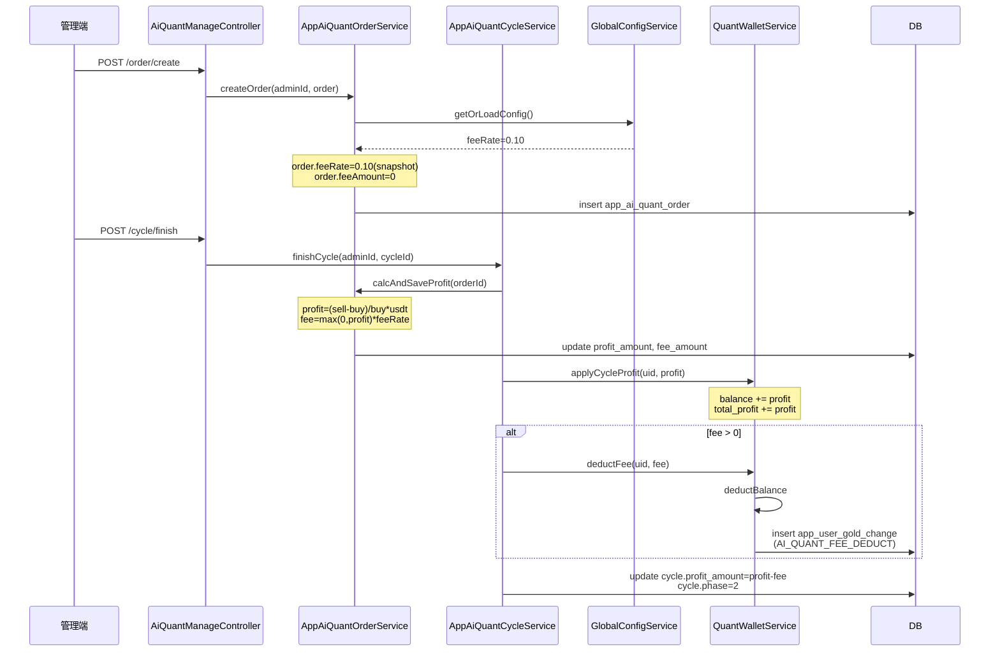

# AI 量化盈利手续费实施方案

## 1. 设计要点（与已有 plan 对齐）

- **费率位置**：`app_ai_quant_global_config.fee_rate`（小数，如 `0.10` 表示 10%）。仅维护单行 `id=1`，与 [AppAiQuantGlobalConfig.kt](mybatis-plus-support/src/main/kotlin/org/lemon/api/modules/aiquant/domain/entity/AppAiQuantGlobalConfig.kt) 现有约定一致。
- **快照保护**：`app_ai_quant_order.fee_rate` 在 `createOrder` 时从全局配置一次性写入（管理员后续改全局费率不影响已建订单），`fee_amount` 在 `calcAndSaveProfit`（周期完成阶段）写入，与 `request_amount_snapshot` / `approved_amount_snapshot` 同套快照逻辑。
- **计费基数**：`fee_amount = max(0, profit_amount) * fee_rate_snapshot`。亏损（profit ≤ 0）不收费，体现"亏损周期免责"，与已有 `applyCycleProfit` 接受负盈利的语义无冲突。
- **资金影响**（独立账变，与盈亏无关）：周期 finishCycle 完成后，调用 `quantWalletService.applyCycleProfit` 将**全额**盈利写入量化池，再单独调用新增的 `deductFee` 扣减手续费、写入 GoldChange 流水（用新增 `AI_QUANT_FEE_DEDUCT` 枚举做账变 tag）。这样 `app_user_quant_wallet.total_profit` 仍然是"原始盈利"，便于报表对账，扣费在 `balance` 与流水表中独立可见。
- **周期净盈利**：`cycle.profit_amount = profit - fee`（用户视角的净盈利），与现有 `cycle.profit_amount` 字段语义保持"用户实际收益"。
- **控制器层**：`AiQuantManageController.createOrder` **不需要**改业务字段；手续费完全由服务端基于全局配置自动快照，避免管理员人工填错。仅在方法注释里说明新行为。

---

## 2. SQL 变更

新增迁移文件 `config/migration_ai_quant_fee.sql`：

```sql
-- ========== 全局配置：新增盈利手续费率 ==========
ALTER TABLE `app_ai_quant_global_config`
  ADD COLUMN `fee_rate` decimal(20,8) NOT NULL DEFAULT 0
    COMMENT 'AI量化盈利手续费率(小数, 如0.10=10%); 仅在周期完成且profit>0时按 fee=profit*fee_rate 收取'
    AFTER `excess_refund_to_spot`;

-- ========== 订单：手续费率快照 + 实际扣费金额(冗余便于对账) ==========
ALTER TABLE `app_ai_quant_order`
  ADD COLUMN `fee_rate` decimal(20,8) NOT NULL DEFAULT 0
    COMMENT 'createOrder时从全局配置快照的手续费率(小数); 后续配置变动不影响本单'
    AFTER `profit_rate`,
  ADD COLUMN `fee_amount` decimal(32,16) NOT NULL DEFAULT 0
    COMMENT '周期完成时计算的实际手续费(USDT) = max(0, profit_amount) * fee_rate; 亏损=0'
    AFTER `fee_rate`;
```

冗余说明：`fee_rate` 在 `app_ai_quant_global_config` 与 `app_ai_quant_order` 都有，前者为当前实时值、后者为快照；`fee_amount` 完全可由 `profit_amount * fee_rate` 推算，但落库便于报表与运营对账。

---

## 3. Kotlin 代码改动

### 3.1 实体：[AppAiQuantGlobalConfig.kt](mybatis-plus-support/src/main/kotlin/org/lemon/api/modules/aiquant/domain/entity/AppAiQuantGlobalConfig.kt)

在 `excessRefundToSpot` 后追加：

```kotlin
/**
 * AI量化盈利手续费率（小数，例如 0.10 = 10%）。
 *
 * - **基数**：周期完成时若 [AppAiQuantOrder.profitAmount] > 0，按 `profit * 本字段` 计算手续费。
 * - **快照**：[AppAiQuantOrder.feeRate] 在 createOrder 时从此字段拷贝；后续修改不影响已建订单。
 * - **默认值**：0，表示不收手续费，向后兼容历史数据。
 */
@ApiModelProperty("AI量化盈利手续费率(小数,如0.10=10%)")
@TableField("fee_rate")
@JsonSerialize(using = Serializers.BigDecimalSerializer::class)
var feeRate: BigDecimal? = null
```

### 3.2 实体：[AppAiQuantOrder.kt](mybatis-plus-support/src/main/kotlin/org/lemon/api/modules/aiquant/domain/entity/AppAiQuantOrder.kt)

在 `profitRate` 后追加：

```kotlin
/**
 * 手续费率快照（小数）。
 *
 * - **来源**：createOrder 阶段从 [AppAiQuantGlobalConfig.feeRate] 拷贝写入；后续全局配置变动不影响本单。
 * - **作用**：周期完成时配合 [profitAmount] 计算 [feeAmount]。
 */
@ApiModelProperty("手续费率快照(小数,createOrder时落库)")
@TableField("fee_rate")
@JsonSerialize(using = Serializers.BigDecimalSerializer::class)
var feeRate: BigDecimal? = null

/**
 * 手续费金额（USDT）。
 *
 * - **公式**：`max(0, profitAmount) * feeRate`，由 [calcAndSaveProfit] 在 finishCycle 阶段计算。
 * - **亏损周期**：`profitAmount <= 0` 时本字段恒为 0，不收手续费。
 * - **资金侧**：[AppAiQuantCycleServiceImpl.finishCycle] 中通过 [AppUserQuantWalletService.deductFee] 单独从量化池扣减并写 GoldChange 流水。
 */
@ApiModelProperty("手续费金额(USDT,finishCycle时按 max(0,profit)*feeRate 计算)")
@TableField("fee_amount")
@JsonSerialize(using = Serializers.BigDecimalSerializer::class)
var feeAmount: BigDecimal? = null
```

### 3.3 枚举：[GoldChangeEnum.kt](mybatis-plus-support/src/main/kotlin/org/lemon/api/modules/userwallet/enums/GoldChangeEnum.kt)

在 `AI_QUANT_PROFIT_IN(59,...)` 后追加：

```kotlin
/** AI量化：盈利周期收取的手续费（量化池扣减，与 [AI_QUANT_PROFIT_IN] 的全额盈利入池配对，差额=用户净盈利） */
AI_QUANT_FEE_DEDUCT(63, "AI量化盈利手续费扣减", "aqfd"),
```

> 说明：现有正向最大码为 `FLASH_EXCHANGE_RECEIVE(62)`；AI_QUANT 段（53-59）为业务系列，因 60-62 已被 OTC/闪兑占用，本枚举使用 63 接续。

### 3.4 DTO：[AiQuantReqs.kt](mybatis-plus-support/src/main/kotlin/org/lemon/api/modules/aiquant/domain/co/AiQuantReqs.kt)

在 `AiQuantGlobalConfigUpdateReq` 中追加：

```kotlin
/**
 * AI量化盈利手续费率（小数）。
 * 例：`0.10` 表示 10%；`0` 表示不收费。
 * 仅在周期完成且 profit_amount > 0 时按 `profit * 本字段` 收取。
 */
@ApiModelProperty("AI量化盈利手续费率(小数,如0.10=10%);0=不收费")
@DecimalMin(value = "0", message = "ai_quant_fee_rate_non_negative")
var feeRate: BigDecimal? = null
```

### 3.5 全局配置 Service 实现：[AppAiQuantGlobalConfigServiceImpl.kt](mybatis-plus-support/src/main/kotlin/org/lemon/api/modules/aiquant/serviceimpl/AppAiQuantGlobalConfigServiceImpl.kt)

- `getOrLoadConfig` 默认行追加：`feeRate = BigDecimal.ZERO`；
- `updateByAdmin` 追加 `feeRate` 的 `let` 块（保持非空字段才更新的现有约定）：

```kotlin
config.feeRate?.let {
    // 防御：负费率视为非法配置；前端校验 + 后端兜底
    if (it < BigDecimal.ZERO) throw BusinessException("ai_quant_fee_rate_non_negative")
    uw.set(AppAiQuantGlobalConfig::feeRate, it)
    any = true
}
```

### 3.6 量化钱包：新增 `deductFee` 方法

[AppUserQuantWalletService.kt](mybatis-plus-support/src/main/kotlin/org/lemon/api/modules/aiquant/service/AppUserQuantWalletService.kt) 接口追加：

```kotlin
/**
 * 周期完成阶段的手续费扣减：
 *
 * - 复用 [deductBalance] 扣减量化池可用余额（不足抛 `ai_quant_pool_insufficient`）。
 * - 同时通过 [AppUserGoldChangeService] 写入一条 [GoldChangeEnum.AI_QUANT_FEE_DEDUCT] 账变快照（与现货 GoldChange 同源），便于运营/对账。
 * - 量化池 `total_profit` 字段不变（仍记录原始盈利），便于"原始收益 vs 净收益"分别口径。
 *
 * @param amount 必须 > 0，否则方法直接 return（finishCycle 已确保 profit>0 才调用）
 */
fun deductFee(userId: Long, amount: BigDecimal, remark: String, coinId: String = Constants.USDT)
```

[AppUserQuantWalletServiceImpl.kt](mybatis-plus-support/src/main/kotlin/org/lemon/api/modules/aiquant/serviceimpl/AppUserQuantWalletServiceImpl.kt) 实现：

```kotlin
/**
 * 量化池盈利手续费扣减实现。
 *
 * 时序：finishCycle 已先 [applyCycleProfit] 把全额盈利写入池子，
 * 故扣费时余额一定足够（profit>0 → balance 增加 ≥ fee）；仍兜底走 [deductBalance] 校验。
 *
 * **审计流水**：写一条 GoldChange 行（asset_type=0），coin_id=量化结算币种（通常 USDT），
 * change_type=[GoldChangeEnum.AI_QUANT_FEE_DEDUCT]，金额为负数。
 * 该记录 **仅作快照**，不参与现货钱包余额计算。
 */
override fun deductFee(userId: Long, amount: BigDecimal, remark: String, coinId: String) {
    if (amount <= BigDecimal.ZERO) return
    // 1) 量化池余额扣减（复用既有方法,日志/异常一致）
    deductBalance(userId, amount, "盈利手续费扣减: $remark", coinId)
    // 2) GoldChange 流水写入（独立审计,不动现货钱包余额）
    goldChangeService.save(
        AppUserGoldChange().apply {
            this.userId = userId
            this.coinId = coinId
            this.changeType = GoldChangeEnum.AI_QUANT_FEE_DEDUCT.code
            this.amount = amount.negate()
            this.assetType = 0
            this.remark = remark
            this.createTime = DateUtil.date()
        }
    )
}
```

> 需要在构造器注入 `AppUserGoldChangeService`，对应 import：
> `import org.lemon.api.modules.userwallet.domain.entity.AppUserGoldChange`
> `import org.lemon.api.modules.userwallet.service.AppUserGoldChangeService`
> `import cn.hutool.core.date.DateUtil`

### 3.7 订单 Service：[AppAiQuantOrderServiceImpl.kt](mybatis-plus-support/src/main/kotlin/org/lemon/api/modules/aiquant/serviceimpl/AppAiQuantOrderServiceImpl.kt)

构造器注入：

```kotlin
private val globalConfigService: AppAiQuantGlobalConfigService,
```

`createOrder`（在 `order.userVisible = 0` 之前插入）追加：

```kotlin
// === 手续费率快照 ===
// 创建订单时从全局配置一次性拷贝费率;
// 后续管理员改全局费率不影响本订单结算时的费用计算,保证"建单即锁定"。
val cfg = globalConfigService.getOrLoadConfig()
order.feeRate = cfg.feeRate ?: BigDecimal.ZERO
order.feeAmount = BigDecimal.ZERO  // 占位,周期完成时再算
```

`calcAndSaveProfit` 在写盘前追加：

```kotlin
// === 手续费金额 ===
// 公式: fee = max(0, profit) * fee_rate_snapshot
// - 亏损周期(profit<=0)免手续费,fee=0
// - 16位小数同 profit 精度,HALF_UP 舍入
val feeRate = row.feeRate ?: BigDecimal.ZERO
val feeAmount = if ((profitAmount ?: BigDecimal.ZERO) > BigDecimal.ZERO && feeRate > BigDecimal.ZERO) {
    profitAmount!!.multiply(feeRate).setScale(16, RoundingMode.HALF_UP)
} else {
    BigDecimal.ZERO
}
```

并在 `update` 中追加 `.set(AppAiQuantOrder::feeAmount, feeAmount)`。

### 3.8 周期 Service：[AppAiQuantCycleServiceImpl.kt](mybatis-plus-support/src/main/kotlin/org/lemon/api/modules/aiquant/serviceimpl/AppAiQuantCycleServiceImpl.kt)

`finishCycle` 在 `applyCycleProfit` 后、订单可见之前插入扣费 + 修正净盈利：

```kotlin
// === 周期完成时扣手续费 ===
// 1) 全额盈利已通过 applyCycleProfit 写入量化池(total_profit=原始盈利)
// 2) 此处单独扣减手续费,产生独立 GoldChange 流水便于运营对账
// 3) cycle.profit_amount 写"净盈利",反映用户实际收益
val fee = order.feeAmount ?: BigDecimal.ZERO
if (fee > BigDecimal.ZERO) {
    quantWalletService.deductFee(
        uid,
        fee,
        "周期[${fresh.cycleNo}]盈利手续费,原始盈利=${profit.stripTrailingZeros().toPlainString()}",
        Constants.USDT,  // 与 applyCycleProfit 同币种
    )
}
val netProfit = profit.subtract(fee)
```

`update(KtUpdateWrapper(AppAiQuantCycle())...)` 中将 `set(AppAiQuantCycle::profitAmount, profit)` 改为 `.set(AppAiQuantCycle::profitAmount, netProfit)`。

### 3.9 控制器：[AiQuantManageController.kt](manage/src/main/kotlin/org/lemon/api/controller/aiquant/AiQuantManageController.kt)

`createOrder` 方法**不改业务字段**（手续费由服务端从全局配置自动快照，避免管理员人工填错）。仅在方法 KDoc 中追加说明：

```kotlin
/**
 * 管理端创建展示订单（草稿）。
 *
 * **手续费快照**（自动）：进入 [AppAiQuantOrderService.createOrder] 后，
 * 服务端会从 [AppAiQuantGlobalConfig.feeRate] 拷贝当前费率到 `order.feeRate`，
 * 作为本订单结算时的"锁定费率"；后续全局配置调整不影响已建订单。
 * 实际扣费金额在周期完成阶段（[AppAiQuantCycleService.finishCycle]）按
 * `max(0, profitAmount) * feeRate` 计算并通过 [AppUserQuantWalletService.deductFee] 单独从量化池扣减，
 * 走 [GoldChangeEnum.AI_QUANT_FEE_DEDUCT] 账变流水。
 */
```

### 3.10 i18n 文案

在 `business` 模块 `i18n/messages*.properties` 追加：

| key | 中文 | 英文 |
|-----|------|------|
| `ai_quant_fee_rate_non_negative` | 手续费率不能为负数 | Fee rate cannot be negative |

---

## 4. 改动文件清单

- 新增 `config/migration_ai_quant_fee.sql`
- 修改 [AppAiQuantGlobalConfig.kt](mybatis-plus-support/src/main/kotlin/org/lemon/api/modules/aiquant/domain/entity/AppAiQuantGlobalConfig.kt)
- 修改 [AppAiQuantOrder.kt](mybatis-plus-support/src/main/kotlin/org/lemon/api/modules/aiquant/domain/entity/AppAiQuantOrder.kt)
- 修改 [GoldChangeEnum.kt](mybatis-plus-support/src/main/kotlin/org/lemon/api/modules/userwallet/enums/GoldChangeEnum.kt)
- 修改 [AiQuantReqs.kt](mybatis-plus-support/src/main/kotlin/org/lemon/api/modules/aiquant/domain/co/AiQuantReqs.kt)（`AiQuantGlobalConfigUpdateReq` 增字段）
- 修改 [AppAiQuantGlobalConfigServiceImpl.kt](mybatis-plus-support/src/main/kotlin/org/lemon/api/modules/aiquant/serviceimpl/AppAiQuantGlobalConfigServiceImpl.kt)
- 修改 [AppUserQuantWalletService.kt](mybatis-plus-support/src/main/kotlin/org/lemon/api/modules/aiquant/service/AppUserQuantWalletService.kt) + Impl
- 修改 [AppAiQuantOrderServiceImpl.kt](mybatis-plus-support/src/main/kotlin/org/lemon/api/modules/aiquant/serviceimpl/AppAiQuantOrderServiceImpl.kt)
- 修改 [AppAiQuantCycleServiceImpl.kt](mybatis-plus-support/src/main/kotlin/org/lemon/api/modules/aiquant/serviceimpl/AppAiQuantCycleServiceImpl.kt)
- 修改 [AiQuantManageController.kt](manage/src/main/kotlin/org/lemon/api/controller/aiquant/AiQuantManageController.kt)（仅注释）
- 修改 `business/src/main/resources/i18n/messages*.properties`（追加 1 个 key）

---

## 5. 时序图



---

## 6. 与已有 plan 的对齐

- **[ai量化预约与整改](.cursor/plans/ai量化预约与整改_06c0e273.plan.md)** 步骤6 中订单 Service 已建立"createOrder 写快照、finishCycle 入池"模型，本方案在此基础上扩展 `feeRate` 快照与 `deductFee` 单独扣费。
- **[ai量化代码精简优化](.cursor/plans/ai量化代码精简优化_de3bbe6d.plan.md)** 已收敛为单轨 cycle 路径，本方案不引入新分支，仅在现有 `createOrder` / `calcAndSaveProfit` / `finishCycle` 三个固定节点插入手续费逻辑。
- **[code review 报告](.cursor/ai_quant_plans_code_review.md)** 3.1 提到 `finishCycle` 多步事务一致性风险；本方案的 `deductFee` 在同一 `RedisLockService.lockTransaction` 块内，遵循同一事务边界，不引入新的原子性问题。`AppUserGoldChange.save` 在事务内若失败会触发整体回滚（量化池扣费、`cycle.phase` 回滚），保持一致性。

---

## 7. 验证

- 编译：`mvn -pl mybatis-plus-support,business,manage -am compile -DskipTests`（注意需 JDK 8/11，与现有 Kotlin 1.6.x 兼容）。
- 手工流程：
  1. `POST /manage/aiQuant/globalConfig/update` 设 `feeRate=0.1`
  2. 用户 reserve → admin auditApprove → admin createOrder（验证 `order.fee_rate=0.1, fee_amount=0`）
  3. admin updateOrder 补全 sellPrice/sellTime（profit > 0）→ admin cycleFinish
  4. 验证：`order.fee_amount = profit * 0.1`，`app_user_quant_wallet.balance` 净增 `profit - fee`，`app_user_quant_wallet.total_profit` 净增 `profit`（原始），`app_user_gold_change` 多一行 `change_type=63` 的负数记录，`cycle.profit_amount = profit - fee`。
- 边界用例：
  - `feeRate=0`：fee_amount=0，无 deductFee 调用，无新增 GoldChange 行
  - `profit<=0`：fee_amount=0，无 deductFee 调用，cycle.profit_amount = profit（负数）
  - 历史已存在订单（无 fee_rate 字段）：DDL 默认 0，老订单完成不收费，向后兼容