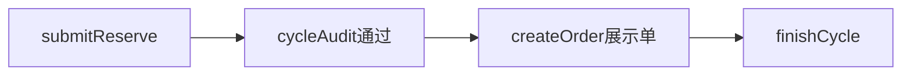

# AI 量化：中文代码注释落点计划

## 需求要点（写入注释的「事实描述」）

- 用户**预约**金额（如 10 万 USDT）写入 [`AppAiQuantCycle.requestAmount`](mybatis-plus-support/src/main/kotlin/org/lemon/api/modules/aiquant/domain/entity/AppAiQuantCycle.kt)；管理端 [`cycleAudit`](manage/src/main/kotlin/org/lemon/api/controller/aiquant/AiQuantManageController.kt) **通过**时写入 [`approvedAmount`](mybatis-plus-support/src/main/kotlin/org/lemon/api/modules/aiquant/domain/entity/AppAiQuantCycle.kt)，**驳回**走全额退回逻辑（与「只谈通过场景」不矛盾）。
- **产品期望**：在整单未走完、周期未完成（未执行 [`finishCycle`](mybatis-plus-support/src/main/kotlin/org/lemon/api/modules/aiquant/serviceimpl/AppAiQuantCycleServiceImpl.kt) / 用户侧未进入「已完成」态）之前，用户**不应**获知后台实际核定并用于展示单的本金（例如申请 10 万、核定 5 万）。
- **与三份计划对齐**：整改方案中「差额退回」「核定本金建单」、精简方案中「完成周期统一算盈亏 + 对用户可见」——注释中可一句串起：**核定本金在库内始终存在，但对 C 端暴露时机应以「周期完成」为界**，与 [`finishCycle`](mybatis-plus-support/src/main/kotlin/org/lemon/api/modules/aiquant/serviceimpl/AppAiQuantCycleServiceImpl.kt) 内 `phase=2`、`order.userVisible=1` 语义一致。

## 实现边界（注释中必须写清，避免误导）

[`AiQuantController.currentHolding`](business/src/main/kotlin/org/lemon/api/controller/aiquant/AiQuantController.kt) 当前直接返回实体 `AppAiQuantCycle` 与可选 `AppAiQuantOrder`；若 JSON 中含 `approvedAmount`，或草稿订单中 [`buyUsdt`](mybatis-plus-support/src/main/kotlin/org/lemon/api/modules/aiquant/serviceimpl/AppAiQuantOrderServiceImpl.kt) 已与核定本金一致，则**技术上用户仍可能推断核定额**。注释目的为：**写清产品设计意图 + 当前返回形态与产品差异（若有）**，不在本任务内改序列化或 DTO（除非你另开任务）。

## 建议修改的文件与注释粒度

| 文件 | 注释内容 |
|------|----------|
| [AppAiQuantCycle.kt](mybatis-plus-support/src/main/kotlin/org/lemon/api/modules/aiquant/domain/entity/AppAiQuantCycle.kt) | 扩充类头 KDoc：`phase` 各态含义；**`requestAmount` vs `approvedAmount`**；**对 C 端：`approvedAmount` 的业务披露应以周期结束为界**（与库字段「审核后即写入」区分）。字段级：`approvedAmount`、`refundedExcess`、`profitAmount`、`linkedOrderId` 各一句中文。 |
| [AppAiQuantCycleServiceImpl.kt](mybatis-plus-support/src/main/kotlin/org/lemon/api/modules/aiquant/serviceimpl/AppAiQuantCycleServiceImpl.kt) | `submitReserve` / `auditApprove` / `auditReject` / `finishCycle`：每个方法上方块注释写清**资金与状态**；`finishCycle` 重点写：**盈亏落库 → 入量化池 → 订单对用户可见 → 周期完成**，与「用户此时才应看到完整结果（含实际用款/盈亏）」一致。 |
| [AppAiQuantCycleService.kt](mybatis-plus-support/src/main/kotlin/org/lemon/api/modules/aiquant/service/AppAiQuantCycleService.kt)（若存在接口） | 接口方法一行中文说明职责，与实现类呼应。 |
| [AppAiQuantOrderServiceImpl.kt](mybatis-plus-support/src/main/kotlin/org/lemon/api/modules/aiquant/serviceimpl/AppAiQuantOrderServiceImpl.kt) | `createOrder`：`buyUsdt` 必须等于周期 `approvedAmount` 的**业务含义**（管理端用款）；`calcAndSaveProfit`：**仅写订单表**，入池在 `finishCycle`。 |
| [AppAiQuantOrder.kt](mybatis-plus-support/src/main/kotlin/org/lemon/api/modules/aiquant/domain/entity/AppAiQuantOrder.kt) | 修正/补充类头：将「发布」表述与当前实现统一为 **周期完成时由 `finishCycle` 置 `userVisible=1`**；`requestAmountSnapshot` / `approvedAmountSnapshot` 一句中文（审计/展示用快照）。 |
| [AiQuantController.kt](business/src/main/kotlin/org/lemon/api/controller/aiquant/AiQuantController.kt) | `currentHolding`、`history`、`summary`：类头或方法上说明 **C 端聚合接口的产品语义**；`currentHolding` 单独一段：**未完成周期下对用户隐藏「实际核定本金」的产品要求**，以及**当前直接序列化实体时的注意点**（不写具体改法，只写「与前端约定或后续专用 VO」）。 |
| [AiQuantManageController.kt](manage/src/main/kotlin/org/lemon/api/controller/aiquant/AiQuantManageController.kt) | `cycleAudit`、`cycleFinish`：管理端**可**见核定金额；与用户端可见性对比一句。 |

## 不做的事项（本计划范围）

- 不新增/修改 `.md` 文档（含 `docs/`）。
- 不改业务逻辑、不改 SQL、不改 JSON 字段屏蔽（仅注释）；若后续要强一致隐藏字段，另起任务改 DTO/`@JsonView`/独立 VO。

## 验收标准

- 上述文件中关键类与方法具备**完整、可读的中文注释**，能单独阅读注释即理解：预约额、核定本金、差额退回、`finishCycle` 与用户知情边界。
- 注释与现有代码行为一致；对「当前 API 仍可能暴露字段」用**明确一句**标出，避免注释与线上行为矛盾。
