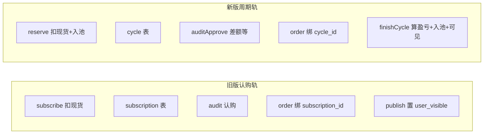
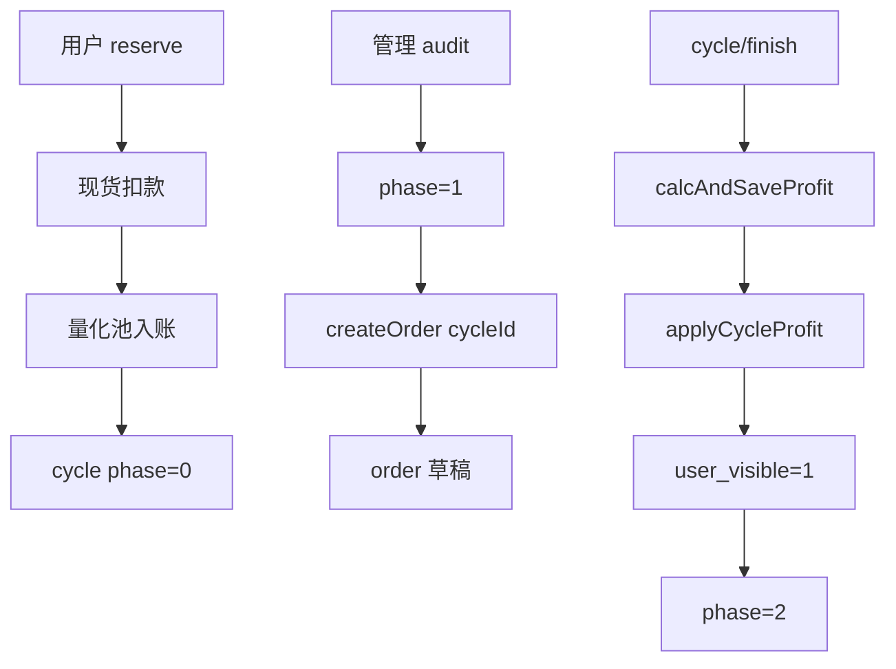

# AI 量化代码精简优化（详细版）

## 1. 背景与目标

### 1.1 问题根因

整改 v2 引入 **周期（Cycle）+ 量化池（QuantWallet）** 后，旧版 **认购（Subscription）** 仍完整保留：Entity/Mapper/Service、管理端分页与审核、订单 `createOrder` 的双分支、`AiQuantReqs` 与 `AiQuantV2Reqs` 双文件、以及 `publish` 与 `finishCycle` 两条「对用户可见」路径。功能重叠导致：

- 代码路径与心智负担翻倍；
- 新同学易误用旧接口；
- 测试与回归面变大。

### 1.2 精简原则（必须满足）

- **新版用户侧能力不变**：`/api/aiQuant` 下 `reserve`、`currentHolding`、`history`、`quantBalance`、`withdraw`、`config`、`summary` 行为与数据一致。
- **新版管理侧主流程不变**：周期审核、建单、**周期完成** 仍为唯一「展示单对用户可见 + 盈亏入池」入口。
- **历史数据不删**：`app_ai_quant_subscription` 表、`app_ai_quant_order.subscription_id` 列、`GoldChangeEnum` 53/54/55 **保留**（账变与历史行可解析）。
- **破坏性变更需文档化**：删除的 HTTP 路径与类名写入 [docs/ai_quant_v2_frontend.md](docs/ai_quant_v2_frontend.md) 或本 plan 第 8 节。

---

## 2. 精简前后：业务代码流程对比

### 2.1 精简前（双轨）

两条轨在 **Order 层分叉**，在 **可见性** 上又有 `publish` vs `finishCycle` 两套。

### 2.2 精简后（单轨 + 历史列只读）

旧 Subscription **不再出现在代码路径**；库表与枚举仅用于历史数据与报表兼容。

---

## 3. 详细开发步骤（建议执行顺序）

**顺序依赖**：先做 **全局引用扫描（阶段 A）**，再删类，再改 Order/Wallet，最后合并 DTO 与删端点，避免编译中断过长。

### 阶段 A：引用盘点（只读，不删代码）

1. 在仓库根执行（或 IDE 全局搜索）：

   - `AppAiQuantSubscription`
   - `AppAiQuantSubscriptionService`
   - `AiQuantSubscribeReq`、`AiQuantRedeemReq`、`AiQuantAuditReq`、`AiQuantSubscriptionQueryReq`
   - `AiQuantV2Reqs`（import 路径）
   - `fun publish(`、`/order/publish`

2. 预期命中文件（实施前核对）：

   - [manage/.../AiQuantManageController.kt](manage/src/main/kotlin/org/lemon/api/controller/aiquant/AiQuantManageController.kt)
   - [AppAiQuantOrderServiceImpl.kt](mybatis-plus-support/src/main/kotlin/org/lemon/api/modules/aiquant/serviceimpl/AppAiQuantOrderServiceImpl.kt)
   - [AppAiQuantOrderService.kt](mybatis-plus-support/src/main/kotlin/org/lemon/api/modules/aiquant/service/AppAiQuantOrderService.kt)

3. 确认 **无其它模块**（如定时任务、报表）通过 `SubscriptionService` 访问；若有，改为直接 Mapper 只读查询或保留一个 **只读** `AppAiQuantSubscriptionMapper` + 单方法 `pageForAdmin`（本 plan **默认不保留**，以删为主）。

### 阶段 B：删除旧版 Subscription 运行时（rm-subscription）

| 序号 | 动作 | 说明 |
|------|------|------|
| B1 | 删除 4 个 Kotlin 文件 | Entity / Mapper / Service / ServiceImpl（路径见原 plan 第 38–44 行） |
| B2 | [AiQuantManageController.kt](manage/src/main/kotlin/org/lemon/api/controller/aiquant/AiQuantManageController.kt) | 移除 `subscriptionService` 注入；删除 `GET /subscription/page`、`POST /subscription/audit`；删除相关 import |
| B3 | [RedisKeys.kt](common/src/main/kotlin/org/lemon/api/common/RedisKeys.kt) | 删除 `LOCK_AI_QUANT_SUBSCRIBE`、`LOCK_AI_QUANT_REDEEM`（仅 Subscription 使用） |
| B4 | [AiQuantReqs.kt](mybatis-plus-support/src/main/kotlin/org/lemon/api/modules/aiquant/domain/co/AiQuantReqs.kt) | 删除 4 个旧 DTO 类（Subscribe/Redeem/Audit/SubscriptionQuery） |
| B5 | **不删** SQL 表 `app_ai_quant_subscription` | 迁移脚本不动；可选在 DB 注释「仅历史」 |

**Kotlin 注意**：删除类后，所有 import 与构造注入必须同步删掉，否则 `mvn compile` 失败。

### 阶段 C：Order 仅绑定 cycle（simplify-order）

| 序号 | 动作 | 说明 |
|------|------|------|
| C1 | [AppAiQuantOrderServiceImpl.kt](mybatis-plus-support/src/main/kotlin/org/lemon/api/modules/aiquant/serviceimpl/AppAiQuantOrderServiceImpl.kt) | 移除 `subscriptionService` 依赖；`createOrder` 删除 `else` 分支（subscription 校验）；仅保留 `cycleId` 路径 + 校验 `phase==1`、`linked_order_id` 空、`buyUsdt==approvedAmount` 等 |
| C2 | [AiQuantCreateOrderReq](mybatis-plus-support/src/main/kotlin/org/lemon/api/modules/aiquant/domain/co/AiQuantReqs.kt) | `cycleId` 加 `@NotNull`；删除 `subscriptionId` 字段 |
| C3 | [AiQuantManageController.kt](manage/src/main/kotlin/org/lemon/api/controller/aiquant/AiQuantManageController.kt) | `createOrder` 中删除「`cycleId` 与 `subscriptionId` 互斥/双空」逻辑，改为仅校验 `cycleId != null`；`order.subscriptionId = req.subscriptionId` 删除 |
| C4 | [AiQuantOrderQueryReq](mybatis-plus-support/src/main/kotlin/org/lemon/api/modules/aiquant/domain/co/AiQuantReqs.kt) | 可选删除 `subscriptionId` 筛选字段（若管理端仍需按旧单查历史，可 **暂时保留** 查询条件仅用于 SQL 过滤，不设默认值） |

**逻辑说明**：`AppAiQuantOrder.subscriptionId` 字段保留映射，旧数据 ORM 仍可读；新单 `subscription_id` 恒为 null。

### 阶段 D：合并 DTO + 删除 publish（merge-dto-publish）

| 序号 | 动作 | 说明 |
|------|------|------|
| D1 | 将 [AiQuantV2Reqs.kt](mybatis-plus-support/src/main/kotlin/org/lemon/api/modules/aiquant/domain/co/AiQuantV2Reqs.kt) 全部 class 迁入 `AiQuantReqs.kt`（或按包习惯拆 `domain/co/aiquant/` 子包，**本 plan 推荐单文件合并** 减少文件数） | 合并后删除 `AiQuantV2Reqs.kt` |
| D2 | 全项目替换 `import ...AiQuantV2Reqs` → `import ...AiQuantReqs`（类名不变则仅路径变） | 若类名合并时重命名，需同步 Controller import |
| D3 | [AppAiQuantOrderService.kt](mybatis-plus-support/src/main/kotlin/org/lemon/api/modules/aiquant/service/AppAiQuantOrderService.kt) | 删除 `publish(adminId, orderId)` 方法声明 |
| D4 | [AppAiQuantOrderServiceImpl.kt](mybatis-plus-support/src/main/kotlin/org/lemon/api/modules/aiquant/serviceimpl/AppAiQuantOrderServiceImpl.kt) | 删除 `override fun publish` 实现；保留 `calcAndSaveProfit` |
| D5 | [AiQuantManageController.kt](manage/src/main/kotlin/org/lemon/api/controller/aiquant/AiQuantManageController.kt) | 删除 `POST /order/publish` 方法及 optLog |

**流程说明**：管理端完成展示单对用户可见 **唯一入口** 为 `POST /manage/aiQuant/cycle/finish` → `finishCycle` → `calcAndSaveProfit` + `user_visible=1`。若某环境仍用旧 `publish` 补救，精简后需改用 **finish**（或临时 SQL 改 `user_visible`，不推荐长期）。

### 阶段 E：Wallet 去重与内部合并（dedup-wallet）

| 序号 | 动作 | 说明 |
|------|------|------|
| E1 | [AppUserQuantWalletService.kt](mybatis-plus-support/src/main/kotlin/org/lemon/api/modules/aiquant/service/AppUserQuantWalletService.kt) | 从接口删除 `hasActiveCycle(userId)` |
| E2 | [AppUserQuantWalletServiceImpl.kt](mybatis-plus-support/src/main/kotlin/org/lemon/api/modules/aiquant/serviceimpl/AppUserQuantWalletServiceImpl.kt) | 删除 `AppAiQuantCycleMapper` 若仅用于 `hasActiveCycle`；注入 `AppAiQuantCycleService`，`withdrawToSpot` 内调用 `cycleService.hasActiveCycle(userId)` |
| E3 | **可选** 私有方法 `changeBalance(...)` | 用 `delta`、`flags`（是否累加 totalIn/totalProfit/totalOut）统一 `addBalance` / `deductBalance` / `applyCycleProfit` 的读-改-写，减少重复与日志分散；**注意** `deductBalance` 与 `applyCycleProfit` 语义不同，合并时保持分支清晰 |

**循环依赖注意**：`AppAiQuantCycleServiceImpl` 已依赖 `AppAiQuantOrderService`；若 `CycleService` 再依赖 `WalletService` 而 `WalletService` 再依赖 `CycleService`，需 **仅 Wallet → Cycle** 单向注入；若出现循环，对 `CycleService` 使用 `@Lazy` 或把 `hasActiveCycle` 留在 **公共工具类 + CycleMapper**（次优）。

### 阶段 F：枚举与文档（cleanup-enum）

| 序号 | 动作 | 说明 |
|------|------|------|
| F1 | [GoldChangeEnum.kt](mybatis-plus-support/src/main/kotlin/org/lemon/api/modules/userwallet/enums/GoldChangeEnum.kt) | 删除未使用的 `AI_QUANT_POOL_OUT`；对 `AI_QUANT_SUBSCRIBE`/`REJECT_REFUND`/`REDEEM` 加 `@Deprecated` 与注释「仅历史账变解析」 |
| F2 | [docs/ai_quant_v2_frontend.md](docs/ai_quant_v2_frontend.md) | 增加「已移除接口」小节：`/manage/.../subscription/*`、`/manage/.../order/publish`、以及任何旧用户端 subscribe/redeem（若曾存在） |

### 阶段 G：验证（verify-build）

1. 使用 **JDK 8 或 11**（项目 Kotlin 1.6.x 与 JDK 25 不兼容）执行：`mvn -pl mybatis-plus-support,business,manage -am compile -DskipTests`
2. `grep -r "AppAiQuantSubscription" --include="*.kt"` 应无业务引用（仅保留注释或迁移 SQL 文件除外）
3. 手工走通：reserve → auditApprove → createOrder → update 草稿 → cycle/finish → 用户端 history 可见

---

## 4. 精简后的接口矩阵（管理端）

| 方法 | 路径 | 保留 |
|------|------|------|
| GET | `/manage/aiQuant/cycle/page` | 是 |
| POST | `/manage/aiQuant/cycle/audit` | 是 |
| POST | `/manage/aiQuant/cycle/finish` | 是 |
| GET | `/manage/aiQuant/order/page` | 是 |
| POST | `/manage/aiQuant/order/create` | 是（仅 cycleId） |
| POST | `/manage/aiQuant/order/update` | 是 |
| POST | `/manage/aiQuant/order/delete` | 是 |
| GET | `/manage/aiQuant/globalConfig` | 是 |
| POST | `/manage/aiQuant/globalConfig/update` | 是 |
| GET | `/manage/aiQuant/channel/list` | 是 |
| POST | `/manage/aiQuant/channel/save` | 是 |
| POST | `/manage/aiQuant/channel/delete` | 是 |
| GET | `/manage/aiQuant/subscription/page` | **删** |
| POST | `/manage/aiQuant/subscription/audit` | **删** |
| POST | `/manage/aiQuant/order/publish` | **删** |

---

## 5. 精简后文件与体量（估算）

| 分类 | 精简前 | 精简后 |
|------|--------|--------|
| aiquant Entity | 6 | 5（无 Subscription） |
| aiquant Mapper | 6 | 5 |
| aiquant Service 接口 | 6 | 5 |
| aiquant ServiceImpl | 6 | 5 |
| domain/co | 2 文件 | 1 文件（合并 V2 入主 Req） |
| 管理端接口数 | 15 | 12 |

---

## 6. 风险与回滚

| 风险 | 缓解 |
|------|------|
| 外部系统仍调旧 manage 接口 | 发布前在网关/文档标注废弃；短期可 Nginx 返回 410 + 文案 |
| 历史订单需按 subscription 查 | `order/page` 保留 `subscriptionId` 查询参数（仅 filter DB 列） |
| 合并 DTO 导致 import 大面积变更 | 阶段 A 列清单，分模块提交 |

回滚：Git 恢复删除的 4 个 Subscription 类与 Controller 两段路由即可（表未删则无数据损失）。

---

## 7. 可选增强（不在本次必做）

- 只读 `GET /manage/aiQuant/subscription/page` 使用 **原生 Mapper** 分页，不引入 Service（满足历史审计）。
- 将 `AppAiQuantSubscription` 实体类 **移入** `legacy` 子包仅作 `@TableName` 映射，供报表模块依赖（若仍希望类型安全查历史表）。
