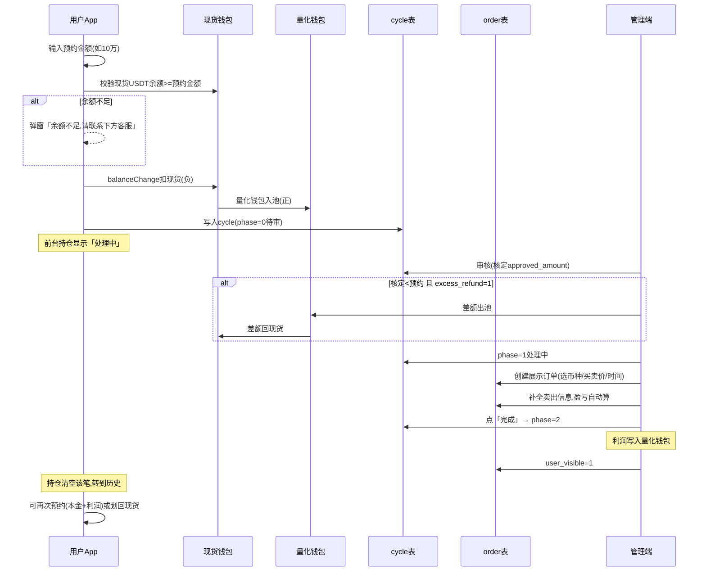

# AI 量化业务整改 — 详细开发步骤

---

## 完整业务流程（对齐产品需求）



---

## 步骤1: DDL

文件：[config/migration_ai_quant_v2.sql](config/migration_ai_quant_v2.sql)

```sql
-- ========== 表A: 全局配置(单行) ==========
CREATE TABLE IF NOT EXISTS `app_ai_quant_global_config` (
  `id` tinyint NOT NULL DEFAULT 1 COMMENT '固定1行',
  `min_reserve_usdt` decimal(32,16) NOT NULL DEFAULT 0 COMMENT '最低预约金额(USDT)',
  `replace_contract_entry` tinyint NOT NULL DEFAULT 1 COMMENT '1=前端量化页替换原合约入口',
  `excess_refund_to_spot` tinyint NOT NULL DEFAULT 1 COMMENT '1=核定差额退回现货;0=留量化池',
  `update_time` datetime DEFAULT CURRENT_TIMESTAMP ON UPDATE CURRENT_TIMESTAMP,
  PRIMARY KEY (`id`)
) ENGINE=InnoDB DEFAULT CHARSET=utf8mb4 COMMENT='AI量化全局配置(单行)';
INSERT IGNORE INTO `app_ai_quant_global_config` (`id`) VALUES (1);

-- ========== 表B: 合作机构(交易对+客服) ==========
CREATE TABLE IF NOT EXISTS `app_ai_quant_service_channel` (
  `id` bigint NOT NULL AUTO_INCREMENT,
  `name` varchar(128) NOT NULL COMMENT '机构名称(展示用)',
  `symbol` varchar(64) NOT NULL COMMENT '展示交易对,如 BTC/USDT',
  `cs_link` varchar(512) NOT NULL COMMENT '客服链接',
  `sort_order` int NOT NULL DEFAULT 0 COMMENT '排序,小靠前',
  `enable` tinyint NOT NULL DEFAULT 1 COMMENT '0下架 1启用',
  `remark` varchar(256) DEFAULT NULL,
  `create_time` datetime DEFAULT CURRENT_TIMESTAMP,
  `update_time` datetime DEFAULT CURRENT_TIMESTAMP ON UPDATE CURRENT_TIMESTAMP,
  PRIMARY KEY (`id`),
  KEY `idx_enable_sort` (`enable`,`sort_order`)
) ENGINE=InnoDB DEFAULT CHARSET=utf8mb4 COMMENT='AI量化合作机构(交易对+客服链接)';

-- ========== 表C: 用户量化钱包 ==========
CREATE TABLE IF NOT EXISTS `app_user_quant_wallet` (
  `id` bigint NOT NULL AUTO_INCREMENT,
  `user_id` bigint NOT NULL,
  `uid` bigint DEFAULT NULL COMMENT '冗余',
  `coin_id` varchar(32) NOT NULL DEFAULT 'USDT',
  `balance` decimal(32,16) NOT NULL DEFAULT 0 COMMENT '量化池可用余额',
  `frozen_balance` decimal(32,16) NOT NULL DEFAULT 0 COMMENT '冻结(预留,暂不用)',
  `total_profit` decimal(32,16) NOT NULL DEFAULT 0 COMMENT '累计盈利(冗余)',
  `total_in` decimal(32,16) NOT NULL DEFAULT 0 COMMENT '累计划入(冗余)',
  `total_out` decimal(32,16) NOT NULL DEFAULT 0 COMMENT '累计划回现货(冗余)',
  `create_time` datetime DEFAULT CURRENT_TIMESTAMP,
  `update_time` datetime DEFAULT CURRENT_TIMESTAMP ON UPDATE CURRENT_TIMESTAMP,
  PRIMARY KEY (`id`),
  UNIQUE KEY `uk_user_coin` (`user_id`,`coin_id`)
) ENGINE=InnoDB DEFAULT CHARSET=utf8mb4 COMMENT='用户量化钱包';

-- ========== 表D: 预约周期 ==========
CREATE TABLE IF NOT EXISTS `app_ai_quant_cycle` (
  `id` bigint NOT NULL AUTO_INCREMENT,
  `user_id` bigint NOT NULL,
  `uid` bigint DEFAULT NULL,
  `user_name` varchar(128) DEFAULT NULL,
  `user_group` int DEFAULT NULL,
  `top_user_id` bigint DEFAULT NULL,
  `t2_id` bigint DEFAULT NULL,
  `cycle_no` varchar(64) NOT NULL COMMENT '周期单号(前缀AQC+雪花)',
  `request_amount` decimal(32,16) NOT NULL COMMENT '用户预约金额(USDT)',
  `approved_amount` decimal(32,16) DEFAULT NULL COMMENT '后台核定本金',
  `refunded_excess` decimal(32,16) NOT NULL DEFAULT 0 COMMENT '已退回现货差额(冗余)',
  `profit_amount` decimal(32,16) DEFAULT NULL COMMENT '本周期最终盈利(完成时写入,冗余)',
  `phase` tinyint NOT NULL DEFAULT 0 COMMENT '0待审 1处理中 2已完成 -1驳回',
  `audit_admin_id` bigint DEFAULT NULL,
  `audit_time` datetime DEFAULT NULL,
  `reject_reason` varchar(512) DEFAULT NULL,
  `finish_time` datetime DEFAULT NULL COMMENT '完成时间',
  `linked_order_id` bigint DEFAULT NULL COMMENT '关联展示订单id',
  `create_time` datetime DEFAULT CURRENT_TIMESTAMP,
  `update_time` datetime DEFAULT CURRENT_TIMESTAMP ON UPDATE CURRENT_TIMESTAMP,
  PRIMARY KEY (`id`),
  KEY `idx_user_phase` (`user_id`,`phase`)
) ENGINE=InnoDB DEFAULT CHARSET=utf8mb4 COMMENT='AI量化预约周期';

-- ========== 表E: 扩展订单表 ==========
ALTER TABLE `app_ai_quant_order`
  ADD COLUMN IF NOT EXISTS `cycle_id` bigint DEFAULT NULL COMMENT '关联周期id' AFTER `subscription_id`,
  ADD COLUMN IF NOT EXISTS `coin_symbol` varchar(32) DEFAULT NULL COMMENT '标的币种(如BTC/USDT)' AFTER `project_name`,
  ADD COLUMN IF NOT EXISTS `request_amount_snapshot` decimal(32,16) DEFAULT NULL COMMENT '预约金额快照' AFTER `buy_usdt`,
  ADD COLUMN IF NOT EXISTS `approved_amount_snapshot` decimal(32,16) DEFAULT NULL COMMENT '核定本金快照' AFTER `request_amount_snapshot`;
```

---

## 步骤2: GoldChangeEnum + RedisKeys

**[GoldChangeEnum.kt](mybatis-plus-support/src/main/kotlin/org/lemon/api/modules/userwallet/enums/GoldChangeEnum.kt)** — 现有 53/54/55 已被原方案占用。新方案在 `AI_QUANT_REDEEM(55,...)` 之后追加：

```kotlin
/** 现货 → 量化池（预约扣现货） */
AI_QUANT_RESERVE_IN(-18, "AI量化预约扣款", "aqri"),
/** 量化池 → 现货（用户划回） */
AI_QUANT_WITHDRAW_TO_SPOT(56, "AI量化划回现货", "aqws"),
/** 核定差额退回现货 */
AI_QUANT_EXCESS_REFUND(57, "AI量化差额退回", "aqer"),
/** 周期驳回全额退回现货 */
AI_QUANT_CYCLE_REJECT_REFUND(58, "AI量化预约驳回退款", "aqcr"),
/** 盈利入量化池 */
AI_QUANT_PROFIT_IN(59, "AI量化盈利入池", "aqpi"),
/** 量化池扣减(核定差额从池扣) */
AI_QUANT_POOL_OUT(-19, "AI量化池扣减", "aqpo"),
```

**[RedisKeys.kt](common/src/main/kotlin/org/lemon/api/common/RedisKeys.kt)** — 新增：

```kotlin
/** AI量化预约用户级锁 */
const val LOCK_AI_QUANT_CYCLE = "lock:ai_quant:cycle:"
/** AI量化划回现货用户级锁 */
const val LOCK_AI_QUANT_WITHDRAW = "lock:ai_quant:withdraw:"
```

---

## 步骤3: Entity + Mapper

需新建 **5 个 Entity + 5 个 Mapper**（含扩展 order 的字段）：

- `AppAiQuantGlobalConfig` — 单行配置，**类注释写明约定 `id=1` 始终只有一行**
- `AppAiQuantServiceChannel` — 机构，**类注释写明 `symbol` 仅展示不参与撮合**
- `AppUserQuantWallet` — 量化池钱包
- `AppAiQuantCycle` — 预约周期
- `AppAiQuantOrder` — 已有，**增加 `cycleId`、`coinSymbol`、`requestAmountSnapshot`、`approvedAmountSnapshot` 四个字段**

Mapper 对齐现有 `@Mapper interface XxxMapper : BaseMapper<Xxx>` 模式。

---

## 步骤4: 量化钱包 Service（核心资金层）

**`AppUserQuantWalletService`**

```kotlin
interface AppUserQuantWalletService : IService<AppUserQuantWallet> {
    /** 幂等查找/创建钱包行 */
    fun findOrCreate(userId: Long, coinId: String = "USDT"): AppUserQuantWallet

    /** 量化池入账(正值); 内部更新 balance += amount, total_in += amount */
    fun addBalance(userId: Long, amount: BigDecimal, remark: String)

    /** 量化池扣减(正值参数,内部取反); 余额不足抛异常 */
    fun deductBalance(userId: Long, amount: BigDecimal, remark: String)

    /** 盈利入账; balance += profit, total_profit += profit */
    fun addProfit(userId: Long, profit: BigDecimal, remark: String)

    /** 划回现货; balance -= amount, total_out += amount, 同时现货 forceBalanceChange(正) */
    fun withdrawToSpot(userId: Long, amount: BigDecimal)
}
```

**Impl 伪代码（`withdrawToSpot` 示例）**：

```kotlin
override fun withdrawToSpot(userId: Long, amount: BigDecimal) {
    val key = RedisKeys.LOCK_AI_QUANT_WITHDRAW + userId
    RedisLockService.lockTransaction(key) {
        // 1. 检查无处理中周期(phase=0 或 phase=1)
        val hasActive = cycleService.hasActiveCycle(userId)
        if (hasActive) throw BusinessException("ai_quant_cycle_not_finished")
        // 2. 扣量化池
        deductBalance(userId, amount, "AI量化划回现货")
        // 3. 现货入账
        walletService.forceBalanceChange(
            ChangeReq.build(userId, "USDT", GoldChangeEnum.AI_QUANT_WITHDRAW_TO_SPOT) {
                balance = amount
                remark = "AI量化划回现货"
            }
        )
    }
}
```

---

## 步骤5: 周期 Service（核心业务层）

**`AppAiQuantCycleService`**

```kotlin
interface AppAiQuantCycleService : IService<AppAiQuantCycle> {
    /** 用户提交预约:
     *  1. 读 global_config.min_reserve_usdt 校验
     *  2. 校验无未完成周期(phase in 0,1)
     *  3. 现货扣款 → 量化池入池 → 插 cycle(phase=0)
     */
    fun submitReserve(userId: Long, requestAmount: BigDecimal)

    /** 管理端审核通过(可部分核定):
     *  1. 校验 phase=0
     *  2. 写 approved_amount
     *  3. 若 excess_refund_to_spot=1 且 approved < request → 差额: 量化池扣减 + 现货入账
     *  4. phase=1
     */
    fun auditApprove(adminId: Long, cycleId: Long, approvedAmount: BigDecimal)

    /** 管理端驳回:
     *  1. 校验 phase=0
     *  2. 量化池全额扣减 → 现货全额退回
     *  3. phase=-1
     */
    fun auditReject(adminId: Long, cycleId: Long, reason: String?)

    /** 管理端完成周期(配合订单完成):
     *  1. 校验 phase=1
     *  2. 读订单 profit_amount → 量化池 addProfit
     *  3. 订单 user_visible=1
     *  4. phase=2, finish_time=now
     */
    fun finishCycle(adminId: Long, cycleId: Long)

    /** 是否有未完成周期(phase=0 或 1) */
    fun hasActiveCycle(userId: Long): Boolean
}
```

**`submitReserve` 伪代码**：

```kotlin
override fun submitReserve(userId: Long, requestAmount: BigDecimal) {
    val key = RedisKeys.LOCK_AI_QUANT_CYCLE + userId
    RedisLockService.lockTransaction(key) {
        // 1. 最低预约金额校验
        val config = globalConfigService.getConfig()
        if (requestAmount < config.minReserveUsdt) {
            throw BusinessException("ai_quant_below_min_reserve")
        }
        // 2. 存在 phase=0 或 phase=1 的周期不允许再次预约
        if (hasActiveCycle(userId)) {
            throw BusinessException("ai_quant_cycle_active")
        }
        val cycleNo = "AQC" + GeneratorIdUtil.generateId()
        // 3. 现货扣款(checkBalance=true,余额不足抛 insufficient_wallet_balance)
        walletService.balanceChange(
            ChangeReq.build(userId, "USDT", GoldChangeEnum.AI_QUANT_RESERVE_IN) {
                balance = requestAmount.negate()
                remark = "AI量化预约扣款,单号[$cycleNo]"
            }, true
        )
        // 4. 量化池入池
        quantWalletService.addBalance(userId, requestAmount, "AI量化预约入池,单号[$cycleNo]")
        // 5. 写周期
        val appUser = userService.getById(userId) ?: throw BusinessException("user_not_exits")
        val cycle = AppAiQuantCycle().apply {
            this.userId = appUser.id
            this.uid = appUser.uid
            this.userName = appUser.userName
            this.userGroup = appUser.userGroup
            this.topUserId = appUser.topUserId
            this.t2Id = appUser.t2Id
            this.cycleNo = cycleNo
            this.requestAmount = requestAmount
            this.phase = 0 // 待审
        }
        save(cycle)
    }
}
```

**`auditApprove` 伪代码**：

```kotlin
override fun auditApprove(adminId: Long, cycleId: Long, approvedAmount: BigDecimal) {
    val cycle = getById(cycleId) ?: throw BusinessException("params_error")
    if (cycle.phase != 0) throw BusinessException("ai_quant_cycle_already_audited")
    if (approvedAmount > cycle.requestAmount) throw BusinessException("ai_quant_approved_exceeds_request")
    // 差额退回
    val excess = cycle.requestAmount.subtract(approvedAmount)
    val config = globalConfigService.getConfig()
    if (excess > BigDecimal.ZERO && config.excessRefundToSpot == 1) {
        quantWalletService.deductBalance(cycle.userId!!, excess, "核定差额扣池")
        walletService.forceBalanceChange(
            ChangeReq.build(cycle.userId!!, "USDT", GoldChangeEnum.AI_QUANT_EXCESS_REFUND) {
                balance = excess; remark = "AI量化差额退回,单号[${cycle.cycleNo}]"
            }
        )
    }
    // 更新周期
    update(KtUpdateWrapper(AppAiQuantCycle())
        .eq(AppAiQuantCycle::id, cycleId)
        .set(AppAiQuantCycle::approvedAmount, approvedAmount)
        .set(AppAiQuantCycle::refundedExcess, excess)
        .set(AppAiQuantCycle::phase, 1)
        .set(AppAiQuantCycle::auditAdminId, adminId)
        .set(AppAiQuantCycle::auditTime, DateUtil.date())
    )
}
```

**`finishCycle` 伪代码**：

```kotlin
override fun finishCycle(adminId: Long, cycleId: Long) {
    val cycle = getById(cycleId) ?: throw BusinessException("params_error")
    if (cycle.phase != 1) throw BusinessException("ai_quant_cycle_not_processing")
    val orderId = cycle.linkedOrderId ?: throw BusinessException("ai_quant_no_linked_order")
    val order = orderService.getById(orderId) ?: throw BusinessException("params_error")
    // 1. 自动计算盈亏(与原方案 publish 公式完全一致)
    //    profit_amount = (sell_price - buy_price) / buy_price * buy_usdt
    //    profit_rate   = profit_amount / buy_usdt
    //    coin_quantity = buy_usdt / buy_price
    orderService.calcAndSaveProfit(orderId) // 内部同 publish() 逻辑

    // 2. 盈利入量化池
    val profit = order.profitAmount ?: BigDecimal.ZERO
    if (profit > BigDecimal.ZERO) {
        quantWalletService.addProfit(cycle.userId!!, profit,
            "AI量化盈利入池,周期[${cycle.cycleNo}]")
    }
    // 3. 订单 user_visible=1(用户端历史可见)
    orderService.update(KtUpdateWrapper(AppAiQuantOrder())
        .eq(AppAiQuantOrder::id, orderId)
        .set(AppAiQuantOrder::userVisible, 1))
    // 4. 周期 phase=2
    update(KtUpdateWrapper(AppAiQuantCycle())
        .eq(AppAiQuantCycle::id, cycleId)
        .set(AppAiQuantCycle::phase, 2)
        .set(AppAiQuantCycle::profitAmount, profit)
        .set(AppAiQuantCycle::finishTime, DateUtil.date())
    )
}
```

---

## 步骤6: 订单 Service 调整

在现有 [AppAiQuantOrderServiceImpl](mybatis-plus-support/src/main/kotlin/org/lemon/api/modules/aiquant/serviceimpl/AppAiQuantOrderServiceImpl.kt) 基础上：

- **`createOrder`**：改为校验 **cycle** 而非 subscription；写入 `cycleId`、`coinSymbol`、`requestAmountSnapshot`、`approvedAmountSnapshot` 快照；并把 `linked_order_id` 回写 cycle。
- **`calcAndSaveProfit`**：从现有 `publish()` 中提取盈亏计算逻辑（公式不变），单独方法供 `finishCycle` 调用；不再单独 `user_visible=1`（由周期统一控制）。
- **`updateOrder`**：沿用（仅草稿可改），逻辑不变。

---

## 步骤7: 全局配置 + 机构表 Service

**`AppAiQuantGlobalConfigService`**

```kotlin
interface AppAiQuantGlobalConfigService : IService<AppAiQuantGlobalConfig> {
    /** 读全局配置(永远 id=1) */
    fun getConfig(): AppAiQuantGlobalConfig
    /** 管理端更新(只更新非空字段) */
    fun updateConfig(config: AppAiQuantGlobalConfig)
}
```

**`AppAiQuantServiceChannelService`**

```kotlin
interface AppAiQuantServiceChannelService : IService<AppAiQuantServiceChannel> {
    /** 用户端: 仅返回 enable=1 按 sort_order 排序 */
    fun listEnabled(): List<AppAiQuantServiceChannel>
}
```

---

## 步骤8: 请求/响应 DTO

| DTO 类名 | 用途 | 关键字段 |
|-----------|------|----------|
| `AiQuantReserveReq` | 用户预约 | `amount: BigDecimal` |
| `AiQuantWithdrawReq` | 划回现货 | `amount: BigDecimal` |
| `AiQuantCycleAuditReq` | 管理审核 | `cycleId`, `approved: Boolean`, `approvedAmount?`, `reason?` |
| `AiQuantCycleFinishReq` | 管理完成 | `cycleId` |
| `AiQuantCycleQueryReq` | 管理查询 | 继承 `PageReq`，含 `uid?`, `userName?`, `phase?`, `userGroup?` |
| `AiQuantCreateOrderReq` | 管理建单 | `cycleId`, `coinSymbol`, `buyTime`, `sellTime?`, `buyPrice`, `sellPrice?`, `buyUsdt`, `profitAmount?`, `profitRate?`, `remark?` |
| `AiQuantUpdateOrderReq` | 管理改单 | 同上 + `id` |
| `AiQuantOrderQueryReq` | 管理查订单 | 继承 `PageReq`，含 `uid?`, `userName?`, `userVisible?`, `cycleId?` |
| `AiQuantConfigResp` | 用户聚合配置 | `minReserveUsdt`, `replaceContractEntry`, `channels: List<ChannelVO>` |

---

## 步骤9: 用户端 Controller

**路径 `/api/aiQuant`**，对齐原 [AiQuantController](business/src/main/kotlin/org/lemon/api/controller/aiquant/AiQuantController.kt)：

| 方法 | 路径 | 逻辑 |
|------|------|------|
| `GET /config` | 聚合 | 读 `global_config` + `service_channel(enable=1)` → `AiQuantConfigResp` |
| `POST /reserve` | 预约 | `cycleService.submitReserve(userId, req.amount)` |
| `GET /currentHolding` | 当前持仓 | `cycle` where `user_id=? and phase in (0,1)` + join `order` |
| `GET /history` | 历史持仓(分页) | `cycle` where `user_id=? and phase=2` + join `order(user_visible=1)` |
| `GET /quantBalance` | 量化余额 | `quantWalletService.findOrCreate(userId).balance` |
| `POST /withdraw` | 划回现货 | `quantWalletService.withdrawToSpot(userId, req.amount)` |

**余额不足 code**：`submitReserve` 调用 `walletService.balanceChange(..., true)` 自动抛 `insufficient_wallet_balance`；前端根据此 key 弹窗并指向机构区。

---

## 步骤10: 管理端 Controller

**路径 `/manage/aiQuant`**，对齐原 [AiQuantManageController](manage/src/main/kotlin/org/lemon/api/controller/aiquant/AiQuantManageController.kt)，代理过滤/optLog 模式不变：

| 方法 | 路径 | 逻辑 |
|------|------|------|
| `GET /cycle/page` | 周期分页 | 代理过滤 `topUserId`/`t2Id` + `phase`/`uid`/`userName` 筛选 |
| `POST /cycle/audit` | 审核 | `pass=true` → `cycleService.auditApprove(adminId, req.cycleId, req.approvedAmount)` ; `pass=false` → `auditReject` |
| `POST /cycle/finish` | 完成周期 | `cycleService.finishCycle(adminId, req.cycleId)` |
| `GET /order/page` | 订单分页 | 同上代理过滤 + `cycleId`/`userVisible` 筛选 |
| `POST /order/create` | 建单 | `orderService.createOrder(adminId, order)` — 内部校验 cycle.phase=1 |
| `POST /order/update` | 改单 | 沿用，仅草稿可改 |
| `POST /order/delete` | 删草稿 | 沿用，已发布不可删 |
| `GET /globalConfig` | 读配置 | `globalConfigService.getConfig()` |
| `POST /globalConfig/update` | 改配置 | `globalConfigService.updateConfig(req)` + `optLog` |
| `GET /channel/list` | 机构列表 | `channelService.list()` 全量含停用 |
| `POST /channel/save` | 新增/编辑 | `save/updateById` + `optLog` |
| `POST /channel/delete` | 删机构 | `removeById` + `optLog` |

---

## 步骤11: i18n 文案

在 `messages.properties` / `messages_zh_CN.properties` / `messages_en_US.properties` 追加：

| key | 中文 | 英文 |
|-----|------|------|
| `ai_quant_below_min_reserve` | 低于最低预约金额 | Below minimum reserve amount |
| `ai_quant_cycle_active` | 存在未完成的量化周期,请等待完成后再预约 | Active cycle exists, please wait |
| `ai_quant_cycle_already_audited` | 该周期已审核 | Cycle already audited |
| `ai_quant_approved_exceeds_request` | 核定金额不能超过预约金额 | Approved exceeds request |
| `ai_quant_cycle_not_processing` | 该周期不在处理中状态 | Cycle not processing |
| `ai_quant_no_linked_order` | 该周期尚未关联订单 | No linked order |
| `ai_quant_cycle_not_finished` | 当前有未完成的量化周期,无法划回 | Cannot withdraw with active cycle |
| `ai_quant_pool_insufficient` | 量化池余额不足 | Quant pool balance insufficient |

---

## 新建/修改文件清单

| 类型 | 路径 |
|------|------|
| SQL | `config/migration_ai_quant_v2.sql` |
| 修改 | `GoldChangeEnum.kt` — 追加6枚举 |
| 修改 | `RedisKeys.kt` — 追加2锁 |
| 新建 Entity | `aiquant/domain/entity/AppAiQuantGlobalConfig.kt` |
| 新建 Entity | `aiquant/domain/entity/AppAiQuantServiceChannel.kt` |
| 新建 Entity | `aiquant/domain/entity/AppUserQuantWallet.kt` |
| 新建 Entity | `aiquant/domain/entity/AppAiQuantCycle.kt` |
| 修改 Entity | `aiquant/domain/entity/AppAiQuantOrder.kt` — 增4字段 |
| 新建 Mapper | 4 个新 Mapper |
| 新建 Service | `AppUserQuantWalletService` + Impl |
| 新建 Service | `AppAiQuantCycleService` + Impl |
| 新建 Service | `AppAiQuantGlobalConfigService` + Impl |
| 新建 Service | `AppAiQuantServiceChannelService` + Impl |
| 修改 Service | `AppAiQuantOrderServiceImpl` — createOrder 改绑 cycle,新增 calcAndSaveProfit |
| 新建 DTO | `aiquant/domain/co/AiQuantV2Reqs.kt` |
| 修改 Controller | `AiQuantController.kt` — 替换为预约/持仓/历史/余额/划回/config |
| 修改 Controller | `AiQuantManageController.kt` — 周期审核/完成 + 全局配置/机构 CRUD |
| 修改 i18n | `messages*.properties` — 追加8键 |

---

## 与原方案的差异总结

| 维度 | 原方案(已落地) | 本整改 |
|------|--------------|--------|
| 资金模型 | 直接现货扣款→审核→赎回 | 现货→量化池→核定差额退→利润入池→划回 |
| 周期 | subscription 仅审核/赎回 | cycle: 待审→处理中→完成,强制单周期串行 |
| 订单可见 | 管理员手动 publish | finishCycle 统一:算盈亏+入池+user_visible |
| 配置 | 无全局参数 | 独立 global_config 小表(最低额/差额开关/合约位) |
| 机构 | 无 | 独立 service_channel 小表(名称+交易对+客服链接) |
| 二次预约 | 无约束 | 必须上一周期完成后才可再预约 |
| 划回现货 | 赎回即退 | 仅当无活动周期时允许划回 |
