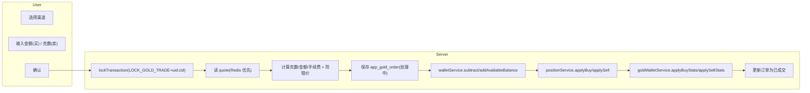
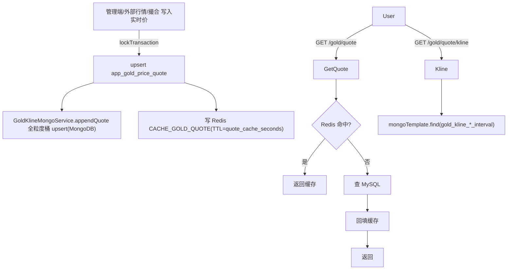

# 积存金（多渠道）业务实施计划

## 一、需求拆解（来自图片）

参考图片要点（按模块）：
- 单渠道详情页（浙商积存金 / 浙商银行(3538)）：当前持有(克)、价值(港币)、成本均价(HKD/克)、持仓收益、累计收益、今日盈亏、实时金价 + 涨跌额/涨跌幅、买入/卖出按钮、收益明细 / 交易记录、行情 K 线（实时/近一月/近三月/近半年/近一年）、底部成交带（XX 以 X HKD/g 卖出/买入 X 克 X 秒前）。
- 多渠道汇总页（黄金持仓）：合计积存金持仓克数 + 估值、合计持仓收益、合计累计收益；按渠道（民生 / 浙商 / 广发 / 工行）分块展示克重/价值、实时价/成本价、持仓收益/累计收益。
- 风险提示横幅、限时福利券位、客服入口（支持每渠道独立客服链接）。

由此抽象出的核心实体与流程：

1. **多账户 / 多渠道**：用户在每个渠道有独立账户（含展示标签如"浙商银行(3538)"），独立持仓与成本均价；汇总页跨渠道求和。
2. **行情**：每个渠道一份实时金价（HKD/克），由「行情写入」驱动并同步维护多粒度 K 线（**MongoDB**），不再使用 MySQL 历史表。
3. **买入**：按金额买入；克数 = 金额 / 实时价（按渠道 `gram_scale`），按全局/渠道费率计手续费。
4. **卖出**：按克数卖出；金额 = 克数 × 实时价 − 手续费；卖出实现盈亏 = (实时价 − 成本均价) × 克数。
5. **持仓**：按渠道维护持有克数、累计成本、成本均价（移动平均），完全卖出后归零。
6. **资金 vs 业务统计**：
   - 资金流（HKD 进出）由 `app_user_wallet` + `app_wallet_operation_log` 负责（沿用现有 `subtractAvailableBalance / addAvailableBalance`）；
   - 积存金账户级汇总（克数、累计成本、累计盈亏、累计手续费、估值）由独立的 `app_user_gold_wallet` 负责。
7. **管理端**：维护渠道、写入实时价、查看用户持仓与订单、维护全局配置；K 线由行情写入自动累积，不需要单独的「导入」入口（保留备用）。

---

## 二、数据库设计（SQL）

数值口径统一：金额/克数 `decimal(32,16)`；价格 `decimal(20,8)`；时间 `datetime`；**业务记账币种默认 `HKD`**。

> 注意：本计划**不再扩展 `app_user_wallet`**；积存金所有账户级汇总都放入新表 `app_user_gold_wallet`。

### 2.1 用户积存金钱包 `app_user_gold_wallet`

```sql
CREATE TABLE IF NOT EXISTS `app_user_gold_wallet` (
  `id` bigint NOT NULL AUTO_INCREMENT,
  `user_id` bigint NOT NULL COMMENT '用户ID',
  `top_user_id` bigint DEFAULT NULL COMMENT '顶级代理ID（与 app_user_wallet 同步，便于代理维度统计）',
  `wallet_id` bigint NOT NULL COMMENT '关联现金钱包 app_user_wallet.id（HKD 主钱包，用于资金流账变核对）',
  `currency_code` varchar(8) NOT NULL DEFAULT 'HKD' COMMENT '记账币种，默认 HKD',
  `total_grams` decimal(32,16) NOT NULL DEFAULT 0 COMMENT '当前持有总克数（跨所有渠道汇总）',
  `total_cost` decimal(32,16) NOT NULL DEFAULT 0 COMMENT '当前持有部分累计成本（移动平均口径，仅本金，不含手续费）',
  `avg_cost_price` decimal(20,8) NOT NULL DEFAULT 0 COMMENT '当前持有加权成本均价（HKD/克）= total_cost / total_grams',
  `total_invest` decimal(32,16) NOT NULL DEFAULT 0 COMMENT '历史累计买入金额（仅本金）',
  `total_realized_profit` decimal(32,16) NOT NULL DEFAULT 0 COMMENT '历史累计已实现盈亏（含正负，卖出累加）',
  `total_holding_profit` decimal(32,16) NOT NULL DEFAULT 0 COMMENT '最近一次估值聚合的总浮盈',
  `total_market_value` decimal(32,16) NOT NULL DEFAULT 0 COMMENT '最近一次估值聚合的总市值',
  `total_buy_fee` decimal(32,16) NOT NULL DEFAULT 0 COMMENT '历史累计买入手续费',
  `total_sell_fee` decimal(32,16) NOT NULL DEFAULT 0 COMMENT '历史累计卖出手续费',
  `last_evaluate_time` datetime DEFAULT NULL COMMENT '最近一次汇总估值时间',
  `version` int NOT NULL DEFAULT 0 COMMENT '乐观锁版本号',
  `status` tinyint NOT NULL DEFAULT 1 COMMENT '0 禁用 1 正常',
  `create_time` datetime DEFAULT CURRENT_TIMESTAMP COMMENT '创建时间',
  `update_time` datetime DEFAULT CURRENT_TIMESTAMP ON UPDATE CURRENT_TIMESTAMP COMMENT '更新时间',
  PRIMARY KEY (`id`),
  UNIQUE KEY `uk_user_currency` (`user_id`, `currency_code`),
  KEY `idx_wallet` (`wallet_id`)
) ENGINE=InnoDB DEFAULT CHARSET=utf8mb4 COMMENT='用户积存金账户汇总';
```

### 2.2 渠道表 `app_gold_channel`

```sql
CREATE TABLE IF NOT EXISTS `app_gold_channel` (
  `id` bigint NOT NULL AUTO_INCREMENT,
  `channel_code` varchar(64) NOT NULL COMMENT '渠道编码：zhejiang / minsheng / guangfa / icbc',
  `channel_name` varchar(128) NOT NULL COMMENT '渠道展示名称：浙商积存金',
  `bank_name` varchar(128) DEFAULT NULL COMMENT '银行名称：浙商银行',
  `account_label` varchar(64) DEFAULT NULL COMMENT '账户尾号标签：浙商银行(3538)',
  `account_tag` varchar(32) DEFAULT NULL COMMENT '账户旗标文案：买金专用',
  `logo_url` varchar(512) DEFAULT NULL COMMENT '渠道 LOGO 图标 URL',
  `cs_link` varchar(512) DEFAULT NULL COMMENT '客服跳转链接',
  `risk_notice_url` varchar(512) DEFAULT NULL COMMENT '风险提示文章链接',
  `currency_code` varchar(8) NOT NULL DEFAULT 'HKD' COMMENT '渠道记账币种（一般继承全局，可按渠道覆盖）',
  `buy_fee_rate` decimal(20,8) NOT NULL DEFAULT 0 COMMENT '买入手续费率（小数；为 0 时回落到全局配置）',
  `sell_fee_rate` decimal(20,8) NOT NULL DEFAULT 0 COMMENT '卖出手续费率（小数；为 0 时回落到全局配置）',
  `min_buy_amount` decimal(32,16) NOT NULL DEFAULT 0 COMMENT '最小单次买入金额；为 0 时回落到全局配置',
  `min_sell_grams` decimal(32,16) NOT NULL DEFAULT 0 COMMENT '最小单次卖出克数；为 0 时回落到全局配置',
  `gram_scale` tinyint NOT NULL DEFAULT 4 COMMENT '克数展示小数位：示例 4 即 285.1925',
  `price_tolerance_bps` int NOT NULL DEFAULT 100 COMMENT '前端期望价与服务端价偏离阈值（万分之，100=1%），超过则拒单',
  `sort_order` int NOT NULL DEFAULT 0 COMMENT '排序，倒序展示在首页',
  `enable_flag` tinyint NOT NULL DEFAULT 1 COMMENT '0 下架 1 上架',
  `remark` varchar(512) DEFAULT NULL COMMENT '后台备注',
  `create_time` datetime DEFAULT CURRENT_TIMESTAMP COMMENT '创建时间',
  `update_time` datetime DEFAULT CURRENT_TIMESTAMP ON UPDATE CURRENT_TIMESTAMP COMMENT '更新时间',
  PRIMARY KEY (`id`),
  UNIQUE KEY `uk_channel_code` (`channel_code`),
  KEY `idx_enable_sort` (`enable_flag`,`sort_order`)
) ENGINE=InnoDB DEFAULT CHARSET=utf8mb4 COMMENT='积存金渠道';
```

### 2.3 实时行情表 `app_gold_price_quote`（每渠道单行实时价）

```sql
CREATE TABLE IF NOT EXISTS `app_gold_price_quote` (
  `id` bigint NOT NULL AUTO_INCREMENT,
  `channel_id` bigint NOT NULL COMMENT '渠道ID',
  `channel_code` varchar(64) NOT NULL COMMENT '渠道编码（与渠道表保持一致，便于直接按编码查行情）',
  `price` decimal(20,8) NOT NULL COMMENT '实时价格（HKD/克）',
  `prev_close_price` decimal(20,8) DEFAULT NULL COMMENT '前日收盘价（用于今日涨跌额/涨跌幅计算，0 点定时任务从昨日 1day 桶写入）',
  `change_amount` decimal(20,8) DEFAULT NULL COMMENT '相对前收涨跌额',
  `change_pct` decimal(20,8) DEFAULT NULL COMMENT '相对前收涨跌幅（小数，0.0087 表示 0.87%）',
  `intraday_high` decimal(20,8) DEFAULT NULL COMMENT '当日最高价（行情写入时维护，跨日重置）',
  `intraday_low` decimal(20,8) DEFAULT NULL COMMENT '当日最低价（行情写入时维护，跨日重置）',
  `intraday_open` decimal(20,8) DEFAULT NULL COMMENT '当日开盘价（每日首次行情写入时记录）',
  `quote_time` datetime NOT NULL COMMENT '行情更新时间',
  `trading_status` tinyint NOT NULL DEFAULT 1 COMMENT '0 休市 1 交易中 2 已收盘',
  `volume` decimal(32,16) NOT NULL DEFAULT 0 COMMENT '当日累计成交克数（撮合维护；外部行情可为 0）',
  `update_time` datetime DEFAULT CURRENT_TIMESTAMP ON UPDATE CURRENT_TIMESTAMP COMMENT '记录更新时间',
  PRIMARY KEY (`id`),
  UNIQUE KEY `uk_channel` (`channel_id`)
) ENGINE=InnoDB DEFAULT CHARSET=utf8mb4 COMMENT='积存金渠道实时金价';
```

### 2.4 用户渠道持仓 `app_gold_position`

```sql
CREATE TABLE IF NOT EXISTS `app_gold_position` (
  `id` bigint NOT NULL AUTO_INCREMENT,
  `user_id` bigint NOT NULL COMMENT '用户ID',
  `gold_wallet_id` bigint NOT NULL COMMENT '关联积存金钱包 app_user_gold_wallet.id',
  `cash_wallet_id` bigint NOT NULL COMMENT '关联现金钱包 app_user_wallet.id（HKD 主钱包）',
  `channel_id` bigint NOT NULL COMMENT '渠道ID',
  `channel_code` varchar(64) NOT NULL COMMENT '渠道编码（与渠道表一致）',
  `currency_code` varchar(8) NOT NULL DEFAULT 'HKD' COMMENT '币种（默认 HKD，与现金钱包对齐）',
  `channel_name_snapshot` varchar(128) DEFAULT NULL COMMENT '建仓时渠道名称快照',
  `account_label_snapshot` varchar(64) DEFAULT NULL COMMENT '建仓时账户标签快照：浙商银行(3538)',
  `hold_grams` decimal(32,16) NOT NULL DEFAULT 0 COMMENT '当前持有克数',
  `hold_cost` decimal(32,16) NOT NULL DEFAULT 0 COMMENT '当前持有部分累计成本（移动平均口径，仅本金）',
  `cost_avg_price` decimal(20,8) NOT NULL DEFAULT 0 COMMENT '成本均价（HKD/克）= hold_cost / hold_grams（克数为 0 时为 0）',
  `last_market_value` decimal(32,16) NOT NULL DEFAULT 0 COMMENT '最近一次估值（持有克数 × 最新价）',
  `last_holding_profit` decimal(32,16) NOT NULL DEFAULT 0 COMMENT '最近一次持仓浮盈（last_market_value − hold_cost）',
  `cumulative_profit` decimal(32,16) NOT NULL DEFAULT 0 COMMENT '累计已实现盈亏（卖出时累加，含正负）',
  `cumulative_invest` decimal(32,16) NOT NULL DEFAULT 0 COMMENT '该渠道历史累计买入金额（仅本金）',
  `cumulative_buy_fee` decimal(32,16) NOT NULL DEFAULT 0 COMMENT '该渠道累计买入手续费',
  `cumulative_sell_fee` decimal(32,16) NOT NULL DEFAULT 0 COMMENT '该渠道累计卖出手续费',
  `today_profit` decimal(32,16) NOT NULL DEFAULT 0 COMMENT '当日盈亏（基于行情前收估算，每日 0 点重置）',
  `today_profit_date` date DEFAULT NULL COMMENT '当日盈亏统计的自然日，用于 0 点重置判断',
  `last_buy_time` datetime DEFAULT NULL COMMENT '最近一次买入时间',
  `last_sell_time` datetime DEFAULT NULL COMMENT '最近一次卖出时间',
  `last_evaluate_time` datetime DEFAULT NULL COMMENT '最近一次估值时间',
  `status` tinyint NOT NULL DEFAULT 1 COMMENT '0 禁用 1 正常',
  `create_time` datetime DEFAULT CURRENT_TIMESTAMP COMMENT '创建时间',
  `update_time` datetime DEFAULT CURRENT_TIMESTAMP ON UPDATE CURRENT_TIMESTAMP COMMENT '更新时间',
  PRIMARY KEY (`id`),
  UNIQUE KEY `uk_user_channel` (`user_id`,`channel_id`),
  KEY `idx_user` (`user_id`),
  KEY `idx_channel` (`channel_id`)
) ENGINE=InnoDB DEFAULT CHARSET=utf8mb4 COMMENT='用户积存金渠道持仓';
```

### 2.5 用户买卖订单 `app_gold_order`

```sql
CREATE TABLE IF NOT EXISTS `app_gold_order` (
  `id` bigint NOT NULL AUTO_INCREMENT,
  `order_no` varchar(64) NOT NULL COMMENT '订单号',
  `user_id` bigint NOT NULL COMMENT '用户ID',
  `gold_wallet_id` bigint NOT NULL COMMENT '积存金钱包ID',
  `cash_wallet_id` bigint NOT NULL COMMENT 'HKD 现金钱包ID',
  `channel_id` bigint NOT NULL COMMENT '渠道ID',
  `channel_code` varchar(64) NOT NULL COMMENT '渠道编码',
  `currency_code` varchar(8) NOT NULL DEFAULT 'HKD' COMMENT '币种',
  `channel_name_snapshot` varchar(128) DEFAULT NULL COMMENT '成交时渠道名称快照',
  `account_label_snapshot` varchar(64) DEFAULT NULL COMMENT '成交时账户标签快照',
  `direction` tinyint NOT NULL COMMENT '方向：1 买入 2 卖出',
  `price` decimal(20,8) NOT NULL COMMENT '成交单价（HKD/克）',
  `expect_price` decimal(20,8) DEFAULT NULL COMMENT '前端展示的期望价（防错价比对）',
  `grams` decimal(32,16) NOT NULL COMMENT '成交克数',
  `amount` decimal(32,16) NOT NULL COMMENT '成交金额（不含手续费，price × grams）',
  `fee_rate` decimal(20,8) NOT NULL DEFAULT 0 COMMENT '手续费率快照',
  `fee_amount` decimal(32,16) NOT NULL DEFAULT 0 COMMENT '手续费金额',
  `wallet_change_amount` decimal(32,16) NOT NULL COMMENT '现金钱包实际变动金额（买入：-amount-fee；卖出：+amount-fee）',
  `cost_avg_price_before` decimal(20,8) DEFAULT NULL COMMENT '成交前的成本均价快照',
  `cost_avg_price_after` decimal(20,8) DEFAULT NULL COMMENT '成交后的成本均价快照',
  `realized_profit` decimal(32,16) DEFAULT NULL COMMENT '本笔实现盈亏（仅卖出有值，不扣手续费的口径）',
  `realized_profit_net` decimal(32,16) DEFAULT NULL COMMENT '本笔实现盈亏（扣除卖出手续费后的净值，仅卖出有值）',
  `quote_id` bigint DEFAULT NULL COMMENT '关联行情ID（成交所用价格的行情来源）',
  `status` tinyint NOT NULL DEFAULT 1 COMMENT '0 处理中 1 已成交 -1 失败',
  `fail_reason` varchar(512) DEFAULT NULL COMMENT '失败原因',
  `remark` varchar(512) DEFAULT NULL COMMENT '备注',
  `finish_time` datetime DEFAULT NULL COMMENT '成交时间',
  `create_time` datetime DEFAULT CURRENT_TIMESTAMP COMMENT '创建时间',
  `update_time` datetime DEFAULT CURRENT_TIMESTAMP ON UPDATE CURRENT_TIMESTAMP COMMENT '更新时间',
  PRIMARY KEY (`id`),
  UNIQUE KEY `uk_order_no` (`order_no`),
  KEY `idx_user_status_time` (`user_id`,`status`,`create_time`),
  KEY `idx_user_channel_dir` (`user_id`,`channel_id`,`direction`),
  KEY `idx_channel_time` (`channel_id`,`create_time`)
) ENGINE=InnoDB DEFAULT CHARSET=utf8mb4 COMMENT='积存金买卖订单';
```

### 2.6 全局配置 `app_gold_global_config`

```sql
CREATE TABLE IF NOT EXISTS `app_gold_global_config` (
  `id` tinyint NOT NULL DEFAULT 1 COMMENT '主键固定 1',
  `default_buy_fee_rate` decimal(20,8) NOT NULL DEFAULT 0 COMMENT '默认买入手续费率（小数）',
  `default_sell_fee_rate` decimal(20,8) NOT NULL DEFAULT 0 COMMENT '默认卖出手续费率（小数）',
  `default_min_buy_amount` decimal(32,16) NOT NULL DEFAULT 0 COMMENT '默认最低买入金额',
  `default_min_sell_grams` decimal(32,16) NOT NULL DEFAULT 0 COMMENT '默认最低卖出克数',
  `default_gram_scale` tinyint NOT NULL DEFAULT 4 COMMENT '默认克数小数位',
  `default_price_tolerance_bps` int NOT NULL DEFAULT 100 COMMENT '默认价格偏离阈值（万分之，100=1%）',
  `currency_code` varchar(8) NOT NULL DEFAULT 'HKD' COMMENT '业务记账币种，默认 HKD',
  `quote_cache_seconds` int NOT NULL DEFAULT 5 COMMENT '行情 Redis 缓存秒数',
  `risk_notice_url` varchar(512) DEFAULT NULL COMMENT '通用风险提示链接',
  `entry_enable` tinyint NOT NULL DEFAULT 1 COMMENT '入口总开关',
  `update_time` datetime DEFAULT CURRENT_TIMESTAMP ON UPDATE CURRENT_TIMESTAMP COMMENT '更新时间',
  PRIMARY KEY (`id`)
) ENGINE=InnoDB DEFAULT CHARSET=utf8mb4 COMMENT='积存金全局配置';

INSERT IGNORE INTO `app_gold_global_config` (`id`) VALUES (1);
```

### 2.7 K 线存储（MongoDB）

不再使用 MySQL 的 `app_gold_price_history` 表。K 线全部走 MongoDB，沿用项目现有 [`Kline.kt`](orm/src/main/kotlin/com/fund/modules/kline/model/Kline.kt) + [`KlineServiceImpl.kt`](orm/src/main/kotlin/com/fund/modules/kline/service/impl/KlineServiceImpl.kt) 的范式：

- 集合命名：`gold_kline_{channelCode}_{interval}`，例如 `gold_kline_zhejiang_1min`、`gold_kline_minsheng_1day`。
- 支持的粒度：`1min / 5min / 30min / 1h / 1day / 1week / 1month`。
- 文档结构（详见步骤 5）：`channelId / channelCode / interval / timestamp(秒) / open / high / low / close / volume / createTime`。
- 写入策略：每次行情入口都按所有粒度对齐时间戳并 upsert 到对应集合（与现有 K 线写入策略一致）。
- 时间戳对齐：**复用现有 [`KlineAggregator`](orm/src/main/kotlin/com/fund/modules/kline/util/KlineAggregator.kt)**，不新建 `GoldKlineAggregator`。传入 `zoneId = ZoneId.of("Asia/Hong_Kong")`（HKD 业务对齐港交所时区）。
- 读取策略：`listKline(channelCode, period)` 直接从 MongoDB 倒序查 `limit` 条。
- 索引策略：每个集合建唯一索引 `{ timestamp: 1 }`（集合已按 channelCode + interval 隔离，无需在索引中重复这两个维度）。
- 数据一致性说明：MongoDB 写入不受 MySQL 事务管控。若 MySQL 事务回滚，MongoDB 已写入的 K 线不会回滚。但由于 K 线 upsert 是幂等操作，后续行情写入会自动覆盖，可接受。

---

## 三、枚举与锁键扩展

### 3.1 [`orm/.../wallet/enum/GoldChangeEnum.kt`](orm/src/main/kotlin/com/fund/modules/wallet/enum/GoldChangeEnum.kt) 新增

```kotlin
/** 积存金买入扣本金（可用减少） */
GOLD_ACC_BUY(701, "积存金买入", "gab"),

/** 积存金买入手续费扣减（可用减少） */
GOLD_ACC_BUY_FEE(702, "积存金买入手续费", "gabf"),

/** 积存金卖出回款（可用增加，含本金回收 + 浮盈/浮亏） */
GOLD_ACC_SELL(703, "积存金卖出", "gas"),

/** 积存金卖出手续费扣减（可用减少） */
GOLD_ACC_SELL_FEE(704, "积存金卖出手续费", "gasf"),
```

### 3.2 [`common/.../common/RedisKeys.kt`](common/src/main/kotlin/com/fund/common/RedisKeys.kt) 新增

```kotlin
/** 积存金用户单渠道交易锁，后缀 userId:channelId */
const val LOCK_GOLD_TRADE = "lock:gold:trade:"

/** 积存金渠道行情写入锁，后缀 channelId */
const val LOCK_GOLD_QUOTE = "lock:gold:quote:"

/** 积存金 K 线写入锁，后缀 channelCode:interval */
const val LOCK_GOLD_KLINE = "lock:gold:kline:"

/** 积存金渠道实时金价缓存键，后缀 channelId */
const val CACHE_GOLD_QUOTE = "cache:gold:quote:"
```

---

## 四、模块文件清单（新增）

- 实体（MySQL）：
  - [`orm/.../modules/gold/model/AppUserGoldWallet.kt`](orm/src/main/kotlin/com/fund/modules/gold/model/AppUserGoldWallet.kt)
  - [`orm/.../modules/gold/model/AppGoldChannel.kt`](orm/src/main/kotlin/com/fund/modules/gold/model/AppGoldChannel.kt)
  - [`orm/.../modules/gold/model/AppGoldPriceQuote.kt`](orm/src/main/kotlin/com/fund/modules/gold/model/AppGoldPriceQuote.kt)
  - [`orm/.../modules/gold/model/AppGoldPosition.kt`](orm/src/main/kotlin/com/fund/modules/gold/model/AppGoldPosition.kt)
  - [`orm/.../modules/gold/model/AppGoldOrder.kt`](orm/src/main/kotlin/com/fund/modules/gold/model/AppGoldOrder.kt)
  - [`orm/.../modules/gold/model/AppGoldGlobalConfig.kt`](orm/src/main/kotlin/com/fund/modules/gold/model/AppGoldGlobalConfig.kt)
- 文档（MongoDB）：
  - [`orm/.../modules/gold/mongo/GoldKline.kt`](orm/src/main/kotlin/com/fund/modules/gold/mongo/GoldKline.kt)
- Mapper：
  - `AppUserGoldWalletMapper.kt` / `AppGoldChannelMapper.kt` / `AppGoldPriceQuoteMapper.kt` / `AppGoldPositionMapper.kt` / `AppGoldOrderMapper.kt` / `AppGoldGlobalConfigMapper.kt`
- Service / ServiceImpl：同名 + Impl，外加 `GoldKlineMongoService`（不继承 `IService`）
  - **`AppGoldChannelService`** / `AppGoldChannelServiceImpl`（渠道 CRUD、上下架、用户端列表）
  - **`AppGoldGlobalConfigService`** / `AppGoldGlobalConfigServiceImpl`（仿 AI 量化 `loadOrCreate / patch`）
- 枚举与常量：
  - [`orm/.../modules/gold/GoldOrderDirection.kt`](orm/src/main/kotlin/com/fund/modules/gold/GoldOrderDirection.kt)
  - [`orm/.../modules/gold/GoldOrderStatus.kt`](orm/src/main/kotlin/com/fund/modules/gold/GoldOrderStatus.kt)
  - [`orm/.../modules/gold/GoldKlinePeriod.kt`](orm/src/main/kotlin/com/fund/modules/gold/GoldKlinePeriod.kt)
- 定时任务：
  - [`orm/.../modules/gold/job/GoldDailyJob.kt`](orm/src/main/kotlin/com/fund/modules/gold/job/GoldDailyJob.kt)（0:00 写 prev_close_price、重置 today_profit）
- VO / 请求 DTO：
  - [`common/.../modules/gold/vo/GoldChannelHomeVo.kt`](common/src/main/kotlin/com/fund/modules/gold/vo/GoldChannelHomeVo.kt)
  - [`common/.../modules/gold/vo/GoldPositionDetailVo.kt`](common/src/main/kotlin/com/fund/modules/gold/vo/GoldPositionDetailVo.kt)
  - [`common/.../modules/gold/vo/GoldHoldingSummaryVo.kt`](common/src/main/kotlin/com/fund/modules/gold/vo/GoldHoldingSummaryVo.kt)
  - [`common/.../modules/gold/vo/GoldKlinePointVo.kt`](common/src/main/kotlin/com/fund/modules/gold/vo/GoldKlinePointVo.kt)
  - [`common/.../modules/gold/request/GoldBuyReq.kt`](common/src/main/kotlin/com/fund/modules/gold/request/GoldBuyReq.kt)
  - [`common/.../modules/gold/request/GoldSellReq.kt`](common/src/main/kotlin/com/fund/modules/gold/request/GoldSellReq.kt)
  - [`common/.../modules/gold/request/GoldOrderPageReq.kt`](common/src/main/kotlin/com/fund/modules/gold/request/GoldOrderPageReq.kt)
  - 后台 DTO：`GoldChannelSaveReq.kt` / `GoldQuoteUpsertReq.kt` / `GoldGlobalConfigUpdateReq.kt` / `GoldChannelPageReq.kt` / `GoldPositionPageReq.kt`
- 控制器：
  - [`business/.../controller/gold/GoldController.kt`](business/src/main/kotlin/com/fund/controller/gold/GoldController.kt)
  - [`manage/.../controller/gold/GoldManageController.kt`](manage/src/main/kotlin/com/fund/controller/gold/GoldManageController.kt)
- 钱包默认值回归：在 [`AppUserWalletV2Service.kt`](orm/src/main/kotlin/com/fund/modules/wallet/service/AppUserWalletV2Service.kt) 与 [`AppUserWalletV2ServiceImpl.kt`](orm/src/main/kotlin/com/fund/modules/wallet/serviceImpl/AppUserWalletV2ServiceImpl.kt) 中把 `createWallet / findWalletByUserAndType` 等的默认 `currencyCode` 由 `"CNY"` 改为 `"HKD"`，并扫描全工程未传参调用点。

---

## 五、详细开发步骤（含代码与功能）

> 通用约定：
> - 所有「写库 + 资金 + 业务统计」流程外层使用 `RedisLockService.lockTransaction(锁键) { ... }`，**不写 `@Transactional`**；同一锁内会同时操作 `app_user_wallet` / `app_user_gold_wallet` / `app_gold_position` / `app_gold_order` / `app_wallet_operation_log`，由本地事务保证原子性。
> - 现金流通过 `AppUserWalletV2Service.subtractAvailableBalance / addAvailableBalance` 完成；积存金账户级汇总通过 `AppUserGoldWalletService` 完成；持仓通过 `AppGoldPositionService` 完成。
> - 金额、克数统一 `decimal(32,16)` + `BigDecimal` + `RoundingMode.HALF_UP`；价格 `decimal(20,8)`。
> - 锁键约定：买卖 `LOCK_GOLD_TRADE + userId + ":" + channelId`；行情写入 `LOCK_GOLD_QUOTE + channelId`；K 线分钟桶 `LOCK_GOLD_KLINE + channelCode + ":" + interval`。
> - K 线 MongoDB 集合：`gold_kline_{channelCode}_{interval}`，与项目现有 [`Kline.kt`](orm/src/main/kotlin/com/fund/modules/kline/model/Kline.kt) 命名规则保持一致风格。时间戳对齐**复用 [`KlineAggregator`](orm/src/main/kotlin/com/fund/modules/kline/util/KlineAggregator.kt)**，不新建工具类；统一传 `ZoneId.of("Asia/Hong_Kong")`。
> - 循环依赖注意：`AppGoldPositionServiceImpl ↔ AppUserGoldWalletServiceImpl` 互相引用，需在其中一方构造参数加 `@Lazy` 打破循环。

### 步骤 0：钱包默认币种回归（HKD）

#### 功能
把现金钱包的默认币种从 `CNY` 改为 `HKD`，使积存金所需的「HKD 主钱包」可与既有充值 / 提现等流程统一。

#### 修改清单
- [`AppUserWalletV2Service.kt`](orm/src/main/kotlin/com/fund/modules/wallet/service/AppUserWalletV2Service.kt) 中所有 `currencyCode: String = "CNY"` 改为 `"HKD"`（含 `createWallet / findWalletByUserAndType / addAvailableBalance / subtractAvailableBalance / freezeBalance / unfreezeBalance / checkBalanceSufficient / freezeAiQuantPrincipal / releaseAiQuantPrincipal / settleAiQuantProfit / accumulateAiQuantStats`）。
- 全工程搜索调用点：未显式传 `currencyCode` 的地方继续按默认走（自动跟随到 HKD）；显式传 `"CNY"` 的需要按业务确认是否一并改 HKD（理财、AI 量化、IPO、提现等）。
- 同步修改 [`AiQuantReserveReq.kt`](common/src/main/kotlin/com/fund/modules/aiquant/request/AiQuantReserveReq.kt) 的默认 `currencyCode = null` 兜底逻辑：`req.currencyCode?.takeIf { it.isNotBlank() } ?: "HKD"`（在 [`AppAiQuantCycleServiceImpl.submitReserve`](orm/src/main/kotlin/com/fund/modules/aiquant/serviceImpl/AppAiQuantCycleServiceImpl.kt) 里现有 `?: "CNY"` 改为 `?: "HKD"`）。

### 步骤 1：扩展 `GoldChangeEnum` 与 `RedisKeys`（详见第三节）

仅追加常量，无需修改既有项。

### 步骤 2：用户积存金钱包 `AppUserGoldWalletService`

#### 功能
- 单独维护「用户 × 币种」维度的积存金账户级汇总：克数、累计成本、成本均价、累计买入、累计已实现盈亏、累计手续费、估值。
- **不直接动现金**：现金流仍交给 `AppUserWalletV2Service`。
- 提供给订单服务两个核心入口：`applyBuyStats / applySellStats`。

#### 实体 [`AppUserGoldWallet.kt`](orm/src/main/kotlin/com/fund/modules/gold/model/AppUserGoldWallet.kt)

```kotlin
/**
 * 积存金账户实体。每个用户每个币种一行（默认 HKD），与 `app_user_wallet` 解耦。
 * 仅承载积存金业务统计，不参与现金账变。
 */
@TableName("app_user_gold_wallet")
class AppUserGoldWallet : Serializable {

    @TableId(value = "id", type = IdType.AUTO)
    var id: Long? = null

    /** 用户ID */
    @TableField("user_id")
    var userId: Long? = null

    /** 顶级代理ID（沿用 app_user_wallet.top_user_id） */
    @TableField("top_user_id")
    var topUserId: Long? = null

    /** 关联现金钱包 app_user_wallet.id（HKD 主钱包） */
    @TableField("wallet_id")
    var walletId: Long? = null

    /** 记账币种，默认 HKD */
    @TableField("currency_code")
    var currencyCode: String? = null

    /** 当前持有总克数（跨所有渠道汇总） */
    @TableField("total_grams")
    var totalGrams: BigDecimal? = null

    /** 当前持有部分累计成本（移动平均口径，仅本金） */
    @TableField("total_cost")
    var totalCost: BigDecimal? = null

    /** 当前持有加权成本均价 */
    @TableField("avg_cost_price")
    var avgCostPrice: BigDecimal? = null

    /** 历史累计买入金额（仅本金） */
    @TableField("total_invest")
    var totalInvest: BigDecimal? = null

    /** 历史累计已实现盈亏（含正负） */
    @TableField("total_realized_profit")
    var totalRealizedProfit: BigDecimal? = null

    /** 最近一次估值聚合的总浮盈 */
    @TableField("total_holding_profit")
    var totalHoldingProfit: BigDecimal? = null

    /** 最近一次估值聚合的总市值 */
    @TableField("total_market_value")
    var totalMarketValue: BigDecimal? = null

    /** 历史累计买入手续费 */
    @TableField("total_buy_fee")
    var totalBuyFee: BigDecimal? = null

    /** 历史累计卖出手续费 */
    @TableField("total_sell_fee")
    var totalSellFee: BigDecimal? = null

    /** 最近一次估值时间 */
    @TableField("last_evaluate_time")
    var lastEvaluateTime: LocalDateTime? = null

    /** 递增版本号（并发安全由 lockTransaction 分布式锁保证，此处仅自增用于审计追踪） */
    @JsonIgnore
    @TableField("version", update = "%s+1")
    var version: Int? = null

    @TableField("status")
    var status: Int? = null

    @TableField(value = "create_time", fill = FieldFill.INSERT)
    var createTime: LocalDateTime? = null

    @TableField(value = "update_time", fill = FieldFill.INSERT_UPDATE)
    var updateTime: LocalDateTime? = null
}
```

#### 接口

```kotlin
interface AppUserGoldWalletService : IService<AppUserGoldWallet> {

    /**
     * 确保用户在指定币种下存在积存金钱包；若 HKD 现金钱包缺失，会先调用 walletService.createWallet 创建。
     * 事务由调用方 lockTransaction 包住，本接口内部不开启 @Transactional。
     */
    fun ensureWallet(userId: Long, topUserId: Long?, currencyCode: String = "HKD"): AppUserGoldWallet

    /** 取已有钱包（不存在返回 null） */
    fun getByUser(userId: Long, currencyCode: String = "HKD"): AppUserGoldWallet?

    /**
     * 买入侧统计累加：
     *   total_grams += grams
     *   total_cost += principal
     *   avg_cost_price = total_cost / total_grams
     *   total_invest += principal
     *   total_buy_fee += buyFee
     */
    fun applyBuyStats(
        wallet: AppUserGoldWallet,
        grams: BigDecimal,
        principal: BigDecimal,
        buyFee: BigDecimal,
    ): AppUserGoldWallet

    /**
     * 卖出侧统计扣减与盈亏累加：
     *   total_grams -= sellGrams（最低归零）
     *   total_cost -= sellCost（最低归零）
     *   avg_cost_price 重算
     *   total_realized_profit += realizedProfit
     *   total_sell_fee += sellFee
     */
    fun applySellStats(
        wallet: AppUserGoldWallet,
        sellGrams: BigDecimal,
        sellCost: BigDecimal,
        realizedProfit: BigDecimal,
        sellFee: BigDecimal,
    ): AppUserGoldWallet

    /**
     * 估值聚合：基于该用户所有 app_gold_position 的最新估值，刷新积存金钱包的
     * total_holding_profit / total_market_value / last_evaluate_time。
     * 主要由「我的持仓汇总」接口触发。
     */
    fun refreshAggregate(userId: Long, currencyCode: String = "HKD"): AppUserGoldWallet?
}
```

#### 关键实现

```kotlin
@Service
open class AppUserGoldWalletServiceImpl(
    private val walletService: AppUserWalletV2Service,
    @Lazy private val positionMapper: AppGoldPositionMapper,
) : ServiceImpl<AppUserGoldWalletMapper, AppUserGoldWallet>(),
    AppUserGoldWalletService {

    override fun ensureWallet(userId: Long, topUserId: Long?, currencyCode: String): AppUserGoldWallet {
        val existing = getByUser(userId, currencyCode)
        if (existing != null) return existing
        // 1) 现金钱包不存在则补建（默认 HKD）
        val cash = walletService.findWalletByUserAndType(userId, 0, currencyCode)
            ?: walletService.createWallet(userId, topUserId, 0, currencyCode)
        // 2) 创建积存金钱包
        val w = AppUserGoldWallet().apply {
            this.userId = userId
            this.topUserId = topUserId
            this.walletId = cash.id
            this.currencyCode = currencyCode
            this.totalGrams = BigDecimal.ZERO
            this.totalCost = BigDecimal.ZERO
            this.avgCostPrice = BigDecimal.ZERO
            this.totalInvest = BigDecimal.ZERO
            this.totalRealizedProfit = BigDecimal.ZERO
            this.totalHoldingProfit = BigDecimal.ZERO
            this.totalMarketValue = BigDecimal.ZERO
            this.totalBuyFee = BigDecimal.ZERO
            this.totalSellFee = BigDecimal.ZERO
            this.status = 1
            this.version = 0
        }
        if (!save(w)) throw BusinessException("创建积存金钱包失败")
        return w
    }

    override fun getByUser(userId: Long, currencyCode: String): AppUserGoldWallet? = getOne(
        KtQueryWrapper(AppUserGoldWallet())
            .eq(AppUserGoldWallet::userId, userId)
            .eq(AppUserGoldWallet::currencyCode, currencyCode)
            .last("limit 1")
    )

    override fun applyBuyStats(
        wallet: AppUserGoldWallet,
        grams: BigDecimal,
        principal: BigDecimal,
        buyFee: BigDecimal,
    ): AppUserGoldWallet {
        if (grams.signum() <= 0 || principal.signum() <= 0) {
            throw BusinessException("买入克数与本金必须大于 0")
        }
        wallet.totalGrams = (wallet.totalGrams ?: BigDecimal.ZERO).add(grams).setScale(16, RoundingMode.HALF_UP)
        wallet.totalCost = (wallet.totalCost ?: BigDecimal.ZERO).add(principal).setScale(16, RoundingMode.HALF_UP)
        wallet.avgCostPrice = if (wallet.totalGrams!!.signum() > 0)
            wallet.totalCost!!.divide(wallet.totalGrams, 8, RoundingMode.HALF_UP) else BigDecimal.ZERO
        wallet.totalInvest = (wallet.totalInvest ?: BigDecimal.ZERO).add(principal).setScale(16, RoundingMode.HALF_UP)
        wallet.totalBuyFee = (wallet.totalBuyFee ?: BigDecimal.ZERO).add(buyFee).setScale(16, RoundingMode.HALF_UP)
        if (!updateById(wallet)) throw BusinessException("积存金钱包更新失败（买入统计）")
        return wallet
    }

    override fun applySellStats(
        wallet: AppUserGoldWallet,
        sellGrams: BigDecimal,
        sellCost: BigDecimal,
        realizedProfit: BigDecimal,
        sellFee: BigDecimal,
    ): AppUserGoldWallet {
        if (sellGrams.signum() <= 0) {
            throw BusinessException("卖出克数必须大于 0")
        }
        val nowGrams = (wallet.totalGrams ?: BigDecimal.ZERO).subtract(sellGrams)
        val nowCost = (wallet.totalCost ?: BigDecimal.ZERO).subtract(sellCost)
        wallet.totalGrams = (if (nowGrams.signum() < 0) BigDecimal.ZERO else nowGrams).setScale(16, RoundingMode.HALF_UP)
        wallet.totalCost = (if (nowCost.signum() < 0) BigDecimal.ZERO else nowCost).setScale(16, RoundingMode.HALF_UP)
        wallet.avgCostPrice = if (wallet.totalGrams!!.signum() > 0)
            wallet.totalCost!!.divide(wallet.totalGrams, 8, RoundingMode.HALF_UP) else BigDecimal.ZERO
        wallet.totalRealizedProfit = (wallet.totalRealizedProfit ?: BigDecimal.ZERO)
            .add(realizedProfit).setScale(16, RoundingMode.HALF_UP)
        wallet.totalSellFee = (wallet.totalSellFee ?: BigDecimal.ZERO)
            .add(sellFee).setScale(16, RoundingMode.HALF_UP)
        if (!updateById(wallet)) throw BusinessException("积存金钱包更新失败（卖出统计）")
        return wallet
    }

    override fun refreshAggregate(userId: Long, currencyCode: String): AppUserGoldWallet? {
        val wallet = getByUser(userId, currencyCode) ?: return null
        val positions = positionMapper.selectList(
            KtQueryWrapper(AppGoldPosition()).eq(AppGoldPosition::userId, userId)
        )
        val z = BigDecimal.ZERO
        wallet.totalMarketValue = positions.fold(z) { a, p -> a.add(p.lastMarketValue ?: z) }
            .setScale(16, RoundingMode.HALF_UP)
        wallet.totalHoldingProfit = positions.fold(z) { a, p -> a.add(p.lastHoldingProfit ?: z) }
            .setScale(16, RoundingMode.HALF_UP)
        wallet.lastEvaluateTime = LocalDateTime.now()
        updateById(wallet)
        return wallet
    }
}
```

### 步骤 3：积存金常量与枚举对象

```kotlin
/** 积存金订单方向 */
object GoldOrderDirection {
    /** 买入 */
    const val BUY: Int = 1

    /** 卖出 */
    const val SELL: Int = 2
}

/** 积存金订单状态 */
object GoldOrderStatus {
    /** 处理中（预留：异步成交场景） */
    const val PROCESSING: Int = 0

    /** 已成交 */
    const val FINISHED: Int = 1

    /** 失败 */
    const val FAILED: Int = -1
}

/**
 * 积存金 K 线区间，用于把界面上的 5 个 Tab 翻译为 (MongoDB interval + 取桶数 limit)。
 * interval 字符串与 MongoDB 集合后缀一致：1min / 5min / 30min / 1h / 1day / 1week / 1month。
 */
enum class GoldKlinePeriod(
    val code: String,
    val interval: String,
    val limit: Int,
) {
    /** 实时图：1 分钟桶，最多 480 桶（约 8 小时） */
    REALTIME("realtime", "1min", 480),

    /** 近一月：日桶 30 个 */
    M1("m1", "1day", 30),

    /** 近三月：日桶 90 个 */
    M3("m3", "1day", 90),

    /** 近半年：日桶 180 个 */
    M6("m6", "1day", 180),

    /** 近一年：日桶 365 个 */
    Y1("y1", "1day", 365);

    companion object {
        fun ofOrDefault(code: String?): GoldKlinePeriod =
            values().firstOrNull { it.code.equals(code, true) } ?: REALTIME
    }
}
```

### 步骤 4：实体（关键示例，其他实体同步落库结构）

```kotlin
/**
 * 积存金渠道实体。
 * 一个渠道对应一家银行的一种积存金账户，前端"黄金持仓"汇总页按渠道分块展示。
 */
@TableName("app_gold_channel")
class AppGoldChannel : Serializable {

    @TableId(type = IdType.AUTO)
    var id: Long? = null

    /** 渠道编码：zhejiang/minsheng/guangfa/icbc 等 */
    @TableField("channel_code")
    var channelCode: String? = null

    /** 渠道展示名称：浙商积存金 */
    @TableField("channel_name")
    var channelName: String? = null

    /** 银行名称：浙商银行 */
    @TableField("bank_name")
    var bankName: String? = null

    /** 账户尾号标签：浙商银行(3538) */
    @TableField("account_label")
    var accountLabel: String? = null

    /** 账户旗标文案：买金专用 */
    @TableField("account_tag")
    var accountTag: String? = null

    @TableField("logo_url")
    var logoUrl: String? = null

    @TableField("cs_link")
    var csLink: String? = null

    @TableField("risk_notice_url")
    var riskNoticeUrl: String? = null

    /** 渠道币种，默认 HKD（与全局对齐，如需多币种渠道可单独覆盖） */
    @TableField("currency_code")
    var currencyCode: String? = null

    /** 买入手续费率（小数，0 时回落全局配置） */
    @TableField("buy_fee_rate")
    var buyFeeRate: BigDecimal? = null

    /** 卖出手续费率（小数，0 时回落全局配置） */
    @TableField("sell_fee_rate")
    var sellFeeRate: BigDecimal? = null

    @TableField("min_buy_amount")
    var minBuyAmount: BigDecimal? = null

    @TableField("min_sell_grams")
    var minSellGrams: BigDecimal? = null

    /** 克数展示小数位（默认 4 位，对应 285.1925） */
    @TableField("gram_scale")
    var gramScale: Int? = null

    /** 防错价偏离阈值（万分之），与全局配置 default_price_tolerance_bps 同义；为 0 时回落全局 */
    @TableField("price_tolerance_bps")
    var priceToleranceBps: Int? = null

    @TableField("sort_order")
    var sortOrder: Int? = null

    @TableField("enable_flag")
    var enableFlag: Int? = null

    @TableField("remark")
    var remark: String? = null

    @TableField(value = "create_time", fill = FieldFill.INSERT)
    var createTime: LocalDateTime? = null

    @TableField(value = "update_time", fill = FieldFill.INSERT_UPDATE)
    var updateTime: LocalDateTime? = null
}
```

#### `AppGoldPriceQuote.kt`

```kotlin
/** 渠道实时金价（每渠道仅一行，行情写入时 upsert） */
@TableName("app_gold_price_quote")
class AppGoldPriceQuote : Serializable {
    @TableId(type = IdType.AUTO) var id: Long? = null
    @TableField("channel_id") var channelId: Long? = null
    @TableField("channel_code") var channelCode: String? = null
    /** 实时价格（HKD/克） */
    @TableField("price") var price: BigDecimal? = null
    /** 前日收盘价（用于涨跌计算） */
    @TableField("prev_close_price") var prevClosePrice: BigDecimal? = null
    @TableField("change_amount") var changeAmount: BigDecimal? = null
    @TableField("change_pct") var changePct: BigDecimal? = null
    @TableField("intraday_high") var intradayHigh: BigDecimal? = null
    @TableField("intraday_low") var intradayLow: BigDecimal? = null
    @TableField("intraday_open") var intradayOpen: BigDecimal? = null
    @TableField("quote_time") var quoteTime: LocalDateTime? = null
    /** 0 休市 1 交易中 2 已收盘 */
    @TableField("trading_status") var tradingStatus: Int? = null
    @TableField("volume") var volume: BigDecimal? = null
    @TableField(value = "update_time", fill = FieldFill.INSERT_UPDATE) var updateTime: LocalDateTime? = null
}
```

#### `AppGoldPosition.kt`

```kotlin
/** 用户渠道持仓（每用户每渠道一行） */
@TableName("app_gold_position")
class AppGoldPosition : Serializable {
    @TableId(type = IdType.AUTO) var id: Long? = null
    @TableField("user_id") var userId: Long? = null
    @TableField("gold_wallet_id") var goldWalletId: Long? = null
    @TableField("cash_wallet_id") var cashWalletId: Long? = null
    @TableField("channel_id") var channelId: Long? = null
    @TableField("channel_code") var channelCode: String? = null
    @TableField("currency_code") var currencyCode: String? = null
    @TableField("channel_name_snapshot") var channelNameSnapshot: String? = null
    @TableField("account_label_snapshot") var accountLabelSnapshot: String? = null
    /** 当前持有克数 */
    @TableField("hold_grams") var holdGrams: BigDecimal? = null
    /** 当前持有部分累计成本（移动平均口径） */
    @TableField("hold_cost") var holdCost: BigDecimal? = null
    /** 成本均价（HKD/克） */
    @TableField("cost_avg_price") var costAvgPrice: BigDecimal? = null
    @TableField("last_market_value") var lastMarketValue: BigDecimal? = null
    @TableField("last_holding_profit") var lastHoldingProfit: BigDecimal? = null
    /** 累计已实现盈亏 */
    @TableField("cumulative_profit") var cumulativeProfit: BigDecimal? = null
    @TableField("cumulative_invest") var cumulativeInvest: BigDecimal? = null
    @TableField("cumulative_buy_fee") var cumulativeBuyFee: BigDecimal? = null
    @TableField("cumulative_sell_fee") var cumulativeSellFee: BigDecimal? = null
    @TableField("today_profit") var todayProfit: BigDecimal? = null
    @TableField("today_profit_date") var todayProfitDate: LocalDate? = null
    @TableField("last_buy_time") var lastBuyTime: LocalDateTime? = null
    @TableField("last_sell_time") var lastSellTime: LocalDateTime? = null
    @TableField("last_evaluate_time") var lastEvaluateTime: LocalDateTime? = null
    @TableField("status") var status: Int? = null
    @TableField(value = "create_time", fill = FieldFill.INSERT) var createTime: LocalDateTime? = null
    @TableField(value = "update_time", fill = FieldFill.INSERT_UPDATE) var updateTime: LocalDateTime? = null
}
```

#### `AppGoldOrder.kt`

```kotlin
/** 积存金买卖订单 */
@TableName("app_gold_order")
class AppGoldOrder : Serializable {
    @TableId(type = IdType.AUTO) var id: Long? = null
    @TableField("order_no") var orderNo: String? = null
    @TableField("user_id") var userId: Long? = null
    @TableField("gold_wallet_id") var goldWalletId: Long? = null
    @TableField("cash_wallet_id") var cashWalletId: Long? = null
    @TableField("channel_id") var channelId: Long? = null
    @TableField("channel_code") var channelCode: String? = null
    @TableField("currency_code") var currencyCode: String? = null
    @TableField("channel_name_snapshot") var channelNameSnapshot: String? = null
    @TableField("account_label_snapshot") var accountLabelSnapshot: String? = null
    /** 方向：1 买入 2 卖出 */
    @TableField("direction") var direction: Int? = null
    @TableField("price") var price: BigDecimal? = null
    @TableField("expect_price") var expectPrice: BigDecimal? = null
    @TableField("grams") var grams: BigDecimal? = null
    @TableField("amount") var amount: BigDecimal? = null
    @TableField("fee_rate") var feeRate: BigDecimal? = null
    @TableField("fee_amount") var feeAmount: BigDecimal? = null
    /** 现金钱包实际变动金额（买入为负、卖出为正） */
    @TableField("wallet_change_amount") var walletChangeAmount: BigDecimal? = null
    @TableField("cost_avg_price_before") var costAvgPriceBefore: BigDecimal? = null
    @TableField("cost_avg_price_after") var costAvgPriceAfter: BigDecimal? = null
    /** 本笔实现盈亏（仅卖出有值，不含手续费口径） */
    @TableField("realized_profit") var realizedProfit: BigDecimal? = null
    /** 本笔实现盈亏（扣除卖出手续费后净值） */
    @TableField("realized_profit_net") var realizedProfitNet: BigDecimal? = null
    @TableField("quote_id") var quoteId: Long? = null
    /** 0 处理中 1 已成交 -1 失败 */
    @TableField("status") var status: Int? = null
    @TableField("fail_reason") var failReason: String? = null
    @TableField("remark") var remark: String? = null
    @TableField("finish_time") var finishTime: LocalDateTime? = null
    @TableField(value = "create_time", fill = FieldFill.INSERT) var createTime: LocalDateTime? = null
    @TableField(value = "update_time", fill = FieldFill.INSERT_UPDATE) var updateTime: LocalDateTime? = null
}
```

#### `AppGoldGlobalConfig.kt`

```kotlin
/** 积存金全局配置（单行表，id 固定 1） */
@TableName("app_gold_global_config")
class AppGoldGlobalConfig : Serializable {
    @TableId(type = IdType.NONE) var id: Int? = null
    @TableField("default_buy_fee_rate") var defaultBuyFeeRate: BigDecimal? = null
    @TableField("default_sell_fee_rate") var defaultSellFeeRate: BigDecimal? = null
    @TableField("default_min_buy_amount") var defaultMinBuyAmount: BigDecimal? = null
    @TableField("default_min_sell_grams") var defaultMinSellGrams: BigDecimal? = null
    @TableField("default_gram_scale") var defaultGramScale: Int? = null
    @TableField("default_price_tolerance_bps") var defaultPriceToleranceBps: Int? = null
    @TableField("currency_code") var currencyCode: String? = null
    @TableField("quote_cache_seconds") var quoteCacheSeconds: Int? = null
    @TableField("risk_notice_url") var riskNoticeUrl: String? = null
    @TableField("entry_enable") var entryEnable: Int? = null
    @TableField(value = "update_time", fill = FieldFill.INSERT_UPDATE) var updateTime: LocalDateTime? = null
}
```

### 步骤 4-A：渠道服务 `AppGoldChannelService`

```kotlin
interface AppGoldChannelService : IService<AppGoldChannel> {
    /** 用户端：上架渠道列表（含实时价与涨跌信息） */
    fun listEnabledForUser(): List<GoldChannelHomeVo>
    /** 按ID取上架渠道（下架则返回 null） */
    fun getEnabledById(id: Long): AppGoldChannel?
    /** 管理端分页 */
    fun managePage(req: GoldChannelPageReq): Page<AppGoldChannel>
    /** 管理端新增/修改渠道 */
    fun upsert(req: GoldChannelSaveReq): AppGoldChannel
    /** 管理端上下架切换 */
    fun toggleEnable(id: Long, enable: Int): Boolean
}

@Service
open class AppGoldChannelServiceImpl(
    private val quoteService: AppGoldPriceQuoteService,
) : ServiceImpl<AppGoldChannelMapper, AppGoldChannel>(), AppGoldChannelService {

    override fun listEnabledForUser(): List<GoldChannelHomeVo> {
        val channels = list(
            KtQueryWrapper(AppGoldChannel())
                .eq(AppGoldChannel::enableFlag, 1)
                .orderByDesc(AppGoldChannel::sortOrder)
        )
        return channels.map { ch ->
            val quote = quoteService.getRealtime(ch.id!!)
            GoldChannelHomeVo(
                channelId = ch.id!!,
                channelCode = ch.channelCode ?: "",
                channelName = ch.channelName ?: "",
                bankName = ch.bankName,
                accountLabel = ch.accountLabel,
                accountTag = ch.accountTag,
                logoUrl = ch.logoUrl,
                csLink = ch.csLink,
                currencyCode = ch.currencyCode ?: "HKD",
                gramScale = ch.gramScale ?: 4,
                price = quote?.price ?: BigDecimal.ZERO,
                changeAmount = quote?.changeAmount ?: BigDecimal.ZERO,
                changePct = quote?.changePct ?: BigDecimal.ZERO,
                tradingStatus = quote?.tradingStatus ?: 0,
                intradayHigh = quote?.intradayHigh,
                intradayLow = quote?.intradayLow,
                intradayOpen = quote?.intradayOpen,
            )
        }
    }

    override fun getEnabledById(id: Long): AppGoldChannel? {
        val ch = getById(id) ?: return null
        return if ((ch.enableFlag ?: 0) == 1) ch else null
    }

    override fun managePage(req: GoldChannelPageReq): Page<AppGoldChannel> {
        val page = Page<AppGoldChannel>(req.current, req.size)
        val w = KtQueryWrapper(AppGoldChannel()).orderByDesc(AppGoldChannel::sortOrder)
        req.enableFlag?.let { w.eq(AppGoldChannel::enableFlag, it) }
        req.channelCode?.let { w.eq(AppGoldChannel::channelCode, it) }
        return page(page, w)
    }

    override fun upsert(req: GoldChannelSaveReq): AppGoldChannel {
        val entity = AppGoldChannel().apply {
            id = req.id
            channelCode = req.channelCode
            channelName = req.channelName
            bankName = req.bankName
            accountLabel = req.accountLabel
            accountTag = req.accountTag
            logoUrl = req.logoUrl
            csLink = req.csLink
            riskNoticeUrl = req.riskNoticeUrl
            currencyCode = req.currencyCode ?: "HKD"
            buyFeeRate = req.buyFeeRate
            sellFeeRate = req.sellFeeRate
            minBuyAmount = req.minBuyAmount
            minSellGrams = req.minSellGrams
            gramScale = req.gramScale
            priceToleranceBps = req.priceToleranceBps
            sortOrder = req.sortOrder
            enableFlag = req.enableFlag
            remark = req.remark
        }
        if (req.id == null) {
            if (!save(entity)) throw BusinessException("新增渠道失败")
        } else {
            if (!updateById(entity)) throw BusinessException("更新渠道失败")
        }
        return getById(entity.id!!)!!
    }

    override fun toggleEnable(id: Long, enable: Int): Boolean {
        val ch = getById(id) ?: throw BusinessException("渠道不存在")
        ch.enableFlag = enable
        return updateById(ch)
    }
}
```

### 步骤 4-B：全局配置服务 `AppGoldGlobalConfigService`

> 仿照 [`AppAiQuantGlobalConfigServiceImpl`](orm/src/main/kotlin/com/fund/modules/aiquant/serviceImpl/AppAiQuantGlobalConfigServiceImpl.kt) 模式。

```kotlin
interface AppGoldGlobalConfigService : IService<AppGoldGlobalConfig> {
    /** 取全局配置；不存在则自动初始化默认行 */
    fun loadOrCreate(): AppGoldGlobalConfig
    /** 部分更新 */
    fun patch(req: GoldGlobalConfigUpdateReq): AppGoldGlobalConfig
}

@Service
open class AppGoldGlobalConfigServiceImpl :
    ServiceImpl<AppGoldGlobalConfigMapper, AppGoldGlobalConfig>(),
    AppGoldGlobalConfigService {

    companion object {
        private const val CONFIG_ID = 1
    }

    override fun loadOrCreate(): AppGoldGlobalConfig {
        val existing = getById(CONFIG_ID)
        if (existing != null) return existing
        val row = AppGoldGlobalConfig().apply {
            id = CONFIG_ID
            defaultBuyFeeRate = BigDecimal.ZERO
            defaultSellFeeRate = BigDecimal.ZERO
            defaultMinBuyAmount = BigDecimal.ZERO
            defaultMinSellGrams = BigDecimal.ZERO
            defaultGramScale = 4
            defaultPriceToleranceBps = 100
            currencyCode = "HKD"
            quoteCacheSeconds = 5
            entryEnable = 1
        }
        if (!save(row)) throw BusinessException("初始化积存金全局配置失败")
        return row
    }

    override fun patch(req: GoldGlobalConfigUpdateReq): AppGoldGlobalConfig {
        val row = loadOrCreate()
        req.defaultBuyFeeRate?.let { row.defaultBuyFeeRate = it }
        req.defaultSellFeeRate?.let { row.defaultSellFeeRate = it }
        req.defaultMinBuyAmount?.let { row.defaultMinBuyAmount = it }
        req.defaultMinSellGrams?.let { row.defaultMinSellGrams = it }
        req.defaultGramScale?.let { row.defaultGramScale = it }
        req.defaultPriceToleranceBps?.let { row.defaultPriceToleranceBps = it }
        req.quoteCacheSeconds?.let { row.quoteCacheSeconds = it }
        req.riskNoticeUrl?.let { row.riskNoticeUrl = it }
        req.entryEnable?.let { row.entryEnable = it }
        if (!updateById(row)) throw BusinessException("更新积存金全局配置失败")
        return row
    }
}
```

### 步骤 5：MongoDB K 线文档与服务

#### 5.1 文档 [`GoldKline.kt`](orm/src/main/kotlin/com/fund/modules/gold/mongo/GoldKline.kt)

```kotlin
/**
 * 积存金行情 K 线文档。
 * 集合命名：gold_kline_{channelCode}_{interval}，例如 gold_kline_zhejiang_1min。
 * timestamp 为对齐到 interval 起始时刻的秒级时间戳，作为文档主键，便于按桶幂等 upsert。
 */
data class GoldKline(
    @Id
    val id: String? = null,

    /** 渠道ID */
    val channelId: Long,

    /** 渠道编码（与 MySQL app_gold_channel.channel_code 一致） */
    val channelCode: String,

    /** 粒度：1min / 5min / 30min / 1h / 1day / 1week / 1month */
    val interval: String,

    /** 桶起始时间戳（秒），按 interval 对齐 */
    val timestamp: Long,

    /** 开盘价（每桶首次写入时保留） */
    val open: BigDecimal,

    /** 最高价（每桶 $max 维护） */
    val high: BigDecimal,

    /** 最低价（每桶 $min 维护） */
    val low: BigDecimal,

    /** 收盘价（每次写入覆盖为当前价） */
    val close: BigDecimal,

    /** 成交克数（撮合时累加，外部行情可为 0） */
    val volume: BigDecimal = BigDecimal.ZERO,

    /** 文档创建/最近更新时间（毫秒） */
    val createTime: Long = System.currentTimeMillis(),
)
```

#### 5.2 时间戳对齐（复用现有 `KlineAggregator`）

**不新建 `GoldKlineAggregator`**，直接复用 [`KlineAggregator`](orm/src/main/kotlin/com/fund/modules/kline/util/KlineAggregator.kt)：

```kotlin
// 用法示例（在 GoldKlineMongoService 中）
import com.fund.modules.kline.util.KlineAggregator

val HK_ZONE: ZoneId = ZoneId.of("Asia/Hong_Kong")

// alignTimestamp 接受毫秒级时间戳，返回秒级已对齐时间戳
val alignedTs = KlineAggregator.alignTimestamp(quoteTimeMillis, interval, HK_ZONE)
```

> `KlineAggregator.alignTimestamp(timestamp: Long, interval: String, zoneId: ZoneId): Long` 接受**毫秒**级时间戳，返回**秒**级对齐后时间戳。  
> `KlineAggregator.getAllIntervals(): List<String>` 返回 7 个粒度字符串。  
> HKD 业务统一传 `ZoneId.of("Asia/Hong_Kong")`。

#### 5.3 服务 `GoldKlineMongoService`

```kotlin
interface GoldKlineMongoService {
    /**
     * 把一次行情写入扩散到所有粒度的桶（1min/5min/.../1month）。
     * 同一桶幂等，使用 timestamp 作为唯一键（集合已按 channelCode + interval 隔离）。
     */
    fun appendQuote(channel: AppGoldChannel, price: BigDecimal, quoteTimeMillis: Long)

    /** 查询某渠道某粒度最近 limit 个桶（按 timestamp 升序返回，便于前端直接画图） */
    fun listLatest(channelCode: String, interval: String, limit: Int): List<GoldKline>
}

@Service
open class GoldKlineMongoServiceImpl(
    private val mongoTemplate: MongoTemplate,
) : GoldKlineMongoService, InitializingBean {

    private val logger = KotlinLogging.logger {}

    companion object {
        /** HKD 业务对齐港交所时区 */
        val HK_ZONE: ZoneId = ZoneId.of("Asia/Hong_Kong")
    }

    /** 启动时为所有已知粒度预建集合与唯一索引 */
    override fun afterPropertiesSet() {
        val intervals = KlineAggregator.getAllIntervals()
        val collectionNames = mongoTemplate.collectionNames
        intervals.forEach { interval ->
            collectionNames
                .filter { it.startsWith("gold_kline_") && it.endsWith("_$interval") }
                .forEach { ensureIndex(it) }
        }
    }

    /** 对单个集合确保 timestamp 唯一索引 */
    private fun ensureIndex(collectionName: String) {
        try {
            val indexOps = mongoTemplate.indexOps(collectionName)
            indexOps.ensureIndex(
                org.springframework.data.mongodb.core.index.Index()
                    .on("timestamp", Sort.Direction.ASC)
                    .unique()
                    .named("uk_timestamp")
            )
        } catch (e: Exception) {
            logger.warn(e) { "创建索引失败: $collectionName" }
        }
    }

    override fun appendQuote(channel: AppGoldChannel, price: BigDecimal, quoteTimeMillis: Long) {
        val cc = channel.channelCode ?: throw BusinessException("渠道编码缺失")
        KlineAggregator.getAllIntervals().forEach { interval ->
            val ts = KlineAggregator.alignTimestamp(quoteTimeMillis, interval, HK_ZONE)
            val collection = "gold_kline_${cc}_${interval}"
            // 集合已按 channelCode + interval 隔离，query 只需 timestamp
            val query = Query(Criteria.where("timestamp").`is`(ts))
            val update = Update()
                .setOnInsert("channelId", channel.id)
                .setOnInsert("channelCode", cc)
                .setOnInsert("interval", interval)
                .setOnInsert("timestamp", ts)
                .setOnInsert("open", price)
                .setOnInsert("volume", BigDecimal.ZERO)
                .max("high", price)
                .min("low", price)
                .set("close", price)
                .set("createTime", System.currentTimeMillis())
            try {
                mongoTemplate.upsert(query, update, GoldKline::class.java, collection)
                ensureIndex(collection)
            } catch (e: Exception) {
                logger.error(e) { "写入金价 K 线失败 channel=$cc interval=$interval ts=$ts" }
            }
        }
    }

    override fun listLatest(channelCode: String, interval: String, limit: Int): List<GoldKline> {
        val collection = "gold_kline_${channelCode}_${interval}"
        val q = Query()
            .with(Sort.by(Sort.Direction.DESC, "timestamp"))
            .limit(limit)
        val list = mongoTemplate.find(q, GoldKline::class.java, collection)
        return list.sortedBy { it.timestamp }
    }
}
```

> 索引说明：`ensureIndex` 在首次写入新集合时自动创建 `{ timestamp: 1 }` 唯一索引，`afterPropertiesSet` 在启动时补全已有集合的索引。由于每个集合已按 `channelCode_interval` 隔离，不需要复合索引。

### 步骤 6：行情服务 `AppGoldPriceQuoteService`

#### 接口

```kotlin
interface AppGoldPriceQuoteService : IService<AppGoldPriceQuote> {
    /** 写入或更新某渠道实时金价（带分布式锁，自动维护 intraday_open/high/low/change_*，并把价格扩散到所有 K 线桶）。 */
    fun upsertQuote(req: GoldQuoteUpsertReq, adminId: Long?): AppGoldPriceQuote

    /** 取实时金价：优先 Redis 缓存，未命中回源 DB 并按全局配置 quote_cache_seconds 回填。 */
    fun getRealtime(channelId: Long): AppGoldPriceQuote?

    /** 取实时金价（按编码） */
    fun getRealtimeByCode(channelCode: String): AppGoldPriceQuote?

    /** 历史 K 线：从 MongoDB 读取，返回升序桶列表 */
    fun listKline(channelCode: String, period: GoldKlinePeriod): List<GoldKline>
}
```

#### 实现要点

```kotlin
@Service
open class AppGoldPriceQuoteServiceImpl(
    private val redissonClient: RedissonClient,
    private val channelService: AppGoldChannelService,
    private val klineService: GoldKlineMongoService,
    private val globalConfigService: AppGoldGlobalConfigService,
) : ServiceImpl<AppGoldPriceQuoteMapper, AppGoldPriceQuote>(),
    AppGoldPriceQuoteService {

    /**
     * 行情写入：
     * 1) 加渠道行情写锁；
     * 2) 计算今日涨跌额/涨跌幅、当日开/高/低；
     * 3) 扩散写入 MongoDB 全粒度 K 线桶；
     * 4) 同步到 Redis 缓存（TTL 来自全局配置）。
     */
    override fun upsertQuote(req: GoldQuoteUpsertReq, adminId: Long?): AppGoldPriceQuote {
        val lockKey = RedisKeys.LOCK_GOLD_QUOTE + req.channelId
        return RedisLockService.lockTransaction(lockKey) {
            val channel = channelService.getById(req.channelId)
                ?: throw BusinessException("渠道不存在")
            if ((channel.enableFlag ?: 0) != 1) {
                throw BusinessException("渠道已下架，禁止写入行情")
            }
            val now = req.quoteTime ?: LocalDateTime.now()
            val price = req.price.setScale(8, RoundingMode.HALF_UP)
            if (price.signum() <= 0) throw BusinessException("行情价格必须大于 0")

            val existing = getOne(
                KtQueryWrapper(AppGoldPriceQuote()).eq(AppGoldPriceQuote::channelId, req.channelId)
            )
            val today = now.toLocalDate()
            val sameDay = existing?.quoteTime?.toLocalDate() == today
            val prevClose = req.prevClosePrice ?: existing?.prevClosePrice ?: price
            val change = price.subtract(prevClose).setScale(8, RoundingMode.HALF_UP)
            val pct = if (prevClose.signum() == 0) BigDecimal.ZERO
                     else change.divide(prevClose, 8, RoundingMode.HALF_UP)
            val open = if (sameDay) existing?.intradayOpen ?: price else price
            val high = if (sameDay) (existing?.intradayHigh ?: price).max(price) else price
            val low = if (sameDay) (existing?.intradayLow ?: price).min(price) else price

            val entity = (existing ?: AppGoldPriceQuote()).apply {
                channelId = req.channelId
                channelCode = channel.channelCode
                this.price = price
                this.prevClosePrice = prevClose
                this.changeAmount = change
                this.changePct = pct
                this.intradayOpen = open
                this.intradayHigh = high
                this.intradayLow = low
                this.quoteTime = now
                this.tradingStatus = req.tradingStatus ?: 1
            }
            if (existing == null) save(entity) else updateById(entity)

            // K 线扩散写入 MongoDB（所有粒度）；传毫秒级时间戳，由 KlineAggregator 按 Asia/Hong_Kong 对齐
            klineService.appendQuote(channel, price, now.atZone(GoldKlineMongoServiceImpl.HK_ZONE).toInstant().toEpochMilli())

            // Redis 缓存
            val cfg = globalConfigService.loadOrCreate()
            val ttl = (cfg.quoteCacheSeconds ?: 5).coerceAtLeast(1).toLong()
            redissonClient.getBucket<AppGoldPriceQuote>(RedisKeys.CACHE_GOLD_QUOTE + req.channelId)
                .set(entity, ttl, TimeUnit.SECONDS)

            entity
        }
    }

    override fun getRealtime(channelId: Long): AppGoldPriceQuote? {
        val cacheKey = RedisKeys.CACHE_GOLD_QUOTE + channelId
        val bucket = redissonClient.getBucket<AppGoldPriceQuote>(cacheKey)
        bucket.get()?.let { return it }
        val db = getOne(
            KtQueryWrapper(AppGoldPriceQuote()).eq(AppGoldPriceQuote::channelId, channelId)
        ) ?: return null
        val cfg = globalConfigService.loadOrCreate()
        val ttl = (cfg.quoteCacheSeconds ?: 5).coerceAtLeast(1).toLong()
        bucket.set(db, ttl, TimeUnit.SECONDS)
        return db
    }

    override fun getRealtimeByCode(channelCode: String): AppGoldPriceQuote? {
        val entity = getOne(
            KtQueryWrapper(AppGoldPriceQuote()).eq(AppGoldPriceQuote::channelCode, channelCode)
        ) ?: return null
        return getRealtime(entity.channelId!!)
    }

    override fun listKline(channelCode: String, period: GoldKlinePeriod): List<GoldKline> =
        klineService.listLatest(channelCode, period.interval, period.limit)
}
```

### 步骤 7：持仓与交易服务

#### 7.1 持仓服务接口与实现

```kotlin
data class GoldPositionApplyResult(
    val costAvgBefore: BigDecimal,
    val costAvgAfter: BigDecimal,
    val sellCost: BigDecimal,
    val realizedProfit: BigDecimal,
    val position: AppGoldPosition,
)

interface AppGoldPositionService : IService<AppGoldPosition> {
    fun findUserChannelPosition(userId: Long, channelId: Long): AppGoldPosition?
    fun listUserPositions(userId: Long): List<AppGoldPosition>

    /** 买入侧持仓更新；若不存在则创建。 */
    fun applyBuy(
        userId: Long,
        cashWalletId: Long,
        goldWalletId: Long,
        channel: AppGoldChannel,
        grams: BigDecimal,
        principal: BigDecimal,
        buyFee: BigDecimal,
    ): GoldPositionApplyResult

    /**
     * 卖出侧持仓更新；返回本笔实现盈亏与销售成本（移动平均口径），方便订单与积存金钱包写入。
     */
    fun applySell(
        position: AppGoldPosition,
        sellGrams: BigDecimal,
        sellPrice: BigDecimal,
        sellFee: BigDecimal,
    ): GoldPositionApplyResult

    /** 估值刷新：根据当前实时价更新 last_market_value / last_holding_profit / today_profit。 */
    fun refreshValuation(position: AppGoldPosition, latestPrice: BigDecimal, prevClose: BigDecimal?)

    fun managePage(req: GoldPositionPageReq): Page<AppGoldPosition>
    fun summaryForUser(userId: Long): GoldHoldingSummaryVo
    fun detailForUser(userId: Long, channelId: Long): GoldPositionDetailVo?
}
```

```kotlin
@Service
open class AppGoldPositionServiceImpl(
    private val channelService: AppGoldChannelService,
    private val quoteService: AppGoldPriceQuoteService,
    @Lazy private val goldWalletService: AppUserGoldWalletService,
) : ServiceImpl<AppGoldPositionMapper, AppGoldPosition>(), AppGoldPositionService {

    companion object {
        /** 估值刷新最小间隔（秒），避免汇总页高频访问导致大量 DB 写 */
        private const val EVALUATE_MIN_INTERVAL_SEC = 10L
    }

    override fun findUserChannelPosition(userId: Long, channelId: Long): AppGoldPosition? = getOne(
        KtQueryWrapper(AppGoldPosition())
            .eq(AppGoldPosition::userId, userId)
            .eq(AppGoldPosition::channelId, channelId)
            .last("limit 1")
    )

    override fun listUserPositions(userId: Long): List<AppGoldPosition> = list(
        KtQueryWrapper(AppGoldPosition())
            .eq(AppGoldPosition::userId, userId)
            .eq(AppGoldPosition::status, 1)
    )

    override fun applyBuy(
        userId: Long,
        cashWalletId: Long,
        goldWalletId: Long,
        channel: AppGoldChannel,
        grams: BigDecimal,
        principal: BigDecimal,
        buyFee: BigDecimal,
    ): GoldPositionApplyResult {
        val pos = findUserChannelPosition(userId, channel.id!!) ?: AppGoldPosition().apply {
            this.userId = userId
            this.cashWalletId = cashWalletId
            this.goldWalletId = goldWalletId
            this.channelId = channel.id
            this.channelCode = channel.channelCode
            this.currencyCode = channel.currencyCode ?: "HKD"
            this.channelNameSnapshot = channel.channelName
            this.accountLabelSnapshot = channel.accountLabel
            this.holdGrams = BigDecimal.ZERO
            this.holdCost = BigDecimal.ZERO
            this.costAvgPrice = BigDecimal.ZERO
            this.cumulativeProfit = BigDecimal.ZERO
            this.cumulativeInvest = BigDecimal.ZERO
            this.cumulativeBuyFee = BigDecimal.ZERO
            this.cumulativeSellFee = BigDecimal.ZERO
            this.todayProfit = BigDecimal.ZERO
            this.status = 1
        }
        val before = pos.costAvgPrice ?: BigDecimal.ZERO
        pos.holdGrams = (pos.holdGrams ?: BigDecimal.ZERO).add(grams).setScale(16, RoundingMode.HALF_UP)
        pos.holdCost = (pos.holdCost ?: BigDecimal.ZERO).add(principal).setScale(16, RoundingMode.HALF_UP)
        pos.cumulativeInvest = (pos.cumulativeInvest ?: BigDecimal.ZERO).add(principal).setScale(16, RoundingMode.HALF_UP)
        pos.cumulativeBuyFee = (pos.cumulativeBuyFee ?: BigDecimal.ZERO).add(buyFee).setScale(16, RoundingMode.HALF_UP)
        pos.costAvgPrice = if (pos.holdGrams!!.signum() > 0)
            pos.holdCost!!.divide(pos.holdGrams, 8, RoundingMode.HALF_UP) else BigDecimal.ZERO
        pos.lastBuyTime = LocalDateTime.now()
        if (pos.id == null) save(pos) else updateById(pos)
        return GoldPositionApplyResult(
            costAvgBefore = before,
            costAvgAfter = pos.costAvgPrice!!,
            sellCost = BigDecimal.ZERO,
            realizedProfit = BigDecimal.ZERO,
            position = pos,
        )
    }

    override fun applySell(
        position: AppGoldPosition,
        sellGrams: BigDecimal,
        sellPrice: BigDecimal,
        sellFee: BigDecimal,
    ): GoldPositionApplyResult {
        val before = position.costAvgPrice ?: BigDecimal.ZERO
        // 移动平均口径：本次卖出对应的成本 = before × sellGrams
        val sellCost = before.multiply(sellGrams).setScale(16, RoundingMode.HALF_UP)
        val sellAmount = sellPrice.multiply(sellGrams).setScale(16, RoundingMode.HALF_UP)
        val realized = sellAmount.subtract(sellCost).setScale(16, RoundingMode.HALF_UP)

        position.holdGrams = (position.holdGrams ?: BigDecimal.ZERO).subtract(sellGrams).setScale(16, RoundingMode.HALF_UP)
        position.holdCost = (position.holdCost ?: BigDecimal.ZERO).subtract(sellCost).setScale(16, RoundingMode.HALF_UP)
        if (position.holdGrams!!.signum() <= 0) {
            position.holdGrams = BigDecimal.ZERO
            position.holdCost = BigDecimal.ZERO
            position.costAvgPrice = BigDecimal.ZERO
        } else {
            position.costAvgPrice = position.holdCost!!.divide(position.holdGrams, 8, RoundingMode.HALF_UP)
        }
        position.cumulativeProfit = (position.cumulativeProfit ?: BigDecimal.ZERO).add(realized).setScale(16, RoundingMode.HALF_UP)
        position.cumulativeSellFee = (position.cumulativeSellFee ?: BigDecimal.ZERO).add(sellFee).setScale(16, RoundingMode.HALF_UP)
        position.lastSellTime = LocalDateTime.now()
        updateById(position)
        return GoldPositionApplyResult(
            costAvgBefore = before,
            costAvgAfter = position.costAvgPrice!!,
            sellCost = sellCost,
            realizedProfit = realized,
            position = position,
        )
    }

    override fun refreshValuation(position: AppGoldPosition, latestPrice: BigDecimal, prevClose: BigDecimal?) {
        // 频率限制：距上次估值未满 EVALUATE_MIN_INTERVAL_SEC 则跳过，减少高频 DB 写
        val lastEval = position.lastEvaluateTime
        if (lastEval != null && java.time.Duration.between(lastEval, LocalDateTime.now()).seconds < EVALUATE_MIN_INTERVAL_SEC) {
            return
        }
        val grams = position.holdGrams ?: BigDecimal.ZERO
        val mv = grams.multiply(latestPrice).setScale(16, RoundingMode.HALF_UP)
        val cost = position.holdCost ?: BigDecimal.ZERO
        position.lastMarketValue = mv
        position.lastHoldingProfit = mv.subtract(cost).setScale(16, RoundingMode.HALF_UP)
        val today = LocalDate.now()
        if (position.todayProfitDate != today) {
            position.todayProfitDate = today
            position.todayProfit = BigDecimal.ZERO
        }
        if (prevClose != null && prevClose.signum() > 0) {
            position.todayProfit = grams.multiply(latestPrice.subtract(prevClose)).setScale(16, RoundingMode.HALF_UP)
        }
        position.lastEvaluateTime = LocalDateTime.now()
        updateById(position)
    }

    override fun summaryForUser(userId: Long): GoldHoldingSummaryVo {
        val positions = listUserPositions(userId)
        val items = positions.mapNotNull { pos ->
            val ch = channelService.getById(pos.channelId!!) ?: return@mapNotNull null
            val quote = quoteService.getRealtime(pos.channelId!!)
            val price = quote?.price ?: pos.costAvgPrice ?: BigDecimal.ZERO
            refreshValuation(pos, price, quote?.prevClosePrice)
            buildDetailVo(ch, pos, quote, price)
        }
        goldWalletService.refreshAggregate(userId, items.firstOrNull()?.currencyCode ?: "HKD")
        val z = BigDecimal.ZERO
        return GoldHoldingSummaryVo(
            totalHoldGrams = items.fold(z) { a, x -> a.add(x.holdGrams) },
            totalHoldValue = items.fold(z) { a, x -> a.add(x.holdValue) },
            totalHoldingProfit = items.fold(z) { a, x -> a.add(x.holdingProfit) },
            totalCumulativeProfit = items.fold(z) { a, x -> a.add(x.cumulativeProfit) },
            currencyCode = items.firstOrNull()?.currencyCode ?: "HKD",
            items = items,
        )
    }

    override fun detailForUser(userId: Long, channelId: Long): GoldPositionDetailVo? {
        val pos = findUserChannelPosition(userId, channelId) ?: return null
        val ch = channelService.getById(channelId) ?: return null
        val quote = quoteService.getRealtime(channelId)
        val price = quote?.price ?: pos.costAvgPrice ?: BigDecimal.ZERO
        refreshValuation(pos, price, quote?.prevClosePrice)
        return buildDetailVo(ch, pos, quote, price)
    }

    override fun managePage(req: GoldPositionPageReq): Page<AppGoldPosition> {
        val page = Page<AppGoldPosition>(req.current, req.size)
        val w = KtQueryWrapper(AppGoldPosition()).orderByDesc(AppGoldPosition::createTime)
        req.userId?.let { w.eq(AppGoldPosition::userId, it) }
        req.channelId?.let { w.eq(AppGoldPosition::channelId, it) }
        return page(page, w)
    }

    /** 构建单渠道详情 VO */
    private fun buildDetailVo(
        ch: AppGoldChannel,
        pos: AppGoldPosition,
        quote: AppGoldPriceQuote?,
        price: BigDecimal,
    ): GoldPositionDetailVo {
        val grams = pos.holdGrams ?: BigDecimal.ZERO
        return GoldPositionDetailVo(
            channelId = ch.id!!,
            channelCode = ch.channelCode ?: "",
            channelName = ch.channelName ?: "",
            accountLabel = pos.accountLabelSnapshot ?: ch.accountLabel,
            accountTag = ch.accountTag,
            logoUrl = ch.logoUrl,
            csLink = ch.csLink,
            currencyCode = pos.currencyCode ?: "HKD",
            holdGrams = grams,
            holdValue = pos.lastMarketValue ?: grams.multiply(price).setScale(16, RoundingMode.HALF_UP),
            costAvgPrice = pos.costAvgPrice ?: BigDecimal.ZERO,
            holdingProfit = pos.lastHoldingProfit ?: BigDecimal.ZERO,
            cumulativeProfit = pos.cumulativeProfit ?: BigDecimal.ZERO,
            todayProfit = pos.todayProfit ?: BigDecimal.ZERO,
            price = price,
            changeAmount = quote?.changeAmount ?: BigDecimal.ZERO,
            changePct = quote?.changePct ?: BigDecimal.ZERO,
            tradingStatus = quote?.tradingStatus ?: 0,
            intradayHigh = quote?.intradayHigh,
            intradayLow = quote?.intradayLow,
            gramScale = ch.gramScale ?: 4,
        )
    }
}
```

#### 7.2 订单服务（核心：现金流 + 业务统计 + 持仓的两层调用）

```kotlin
interface AppGoldOrderService : IService<AppGoldOrder> {
    fun userBuy(userId: Long, req: GoldBuyReq): AppGoldOrder
    fun userSell(userId: Long, req: GoldSellReq): AppGoldOrder
    fun pageMyOrders(userId: Long, req: GoldOrderPageReq): Page<AppGoldOrder>
    fun managePage(req: GoldOrderPageReq): Page<AppGoldOrder>
}

@Service
open class AppGoldOrderServiceImpl(
    private val walletService: AppUserWalletV2Service,
    private val goldWalletService: AppUserGoldWalletService,
    private val channelService: AppGoldChannelService,
    private val quoteService: AppGoldPriceQuoteService,
    private val positionService: AppGoldPositionService,
    private val globalConfigService: AppGoldGlobalConfigService,
) : ServiceImpl<AppGoldOrderMapper, AppGoldOrder>(), AppGoldOrderService {

    override fun userBuy(userId: Long, req: GoldBuyReq): AppGoldOrder {
        val lockKey = RedisKeys.LOCK_GOLD_TRADE + userId + ":" + req.channelId
        return RedisLockService.lockTransaction(lockKey) {
            val cfg = globalConfigService.loadOrCreate()
            val currency = cfg.currencyCode ?: "HKD"
            val channel = channelService.getEnabledById(req.channelId)
                ?: throw BusinessException("渠道不可用")
            val quote = quoteService.getRealtime(req.channelId)
                ?: throw BusinessException("行情未就绪")
            if ((quote.tradingStatus ?: 0) != 1) throw BusinessException("当前非交易时段")
            val price = quote.price ?: throw BusinessException("行情价缺失")

            // 防错价比对
            checkPriceTolerance(req.expectPrice, price, channel, cfg)

            val amount = req.amount.setScale(16, RoundingMode.HALF_UP)
            val minBuy = nonZeroOrFallback(channel.minBuyAmount, cfg.defaultMinBuyAmount)
            if (amount < minBuy) throw BusinessException("买入金额低于最低限额")

            val gramScale = channel.gramScale ?: cfg.defaultGramScale ?: 4
            val grams = amount.divide(price, gramScale, RoundingMode.HALF_UP)
            if (grams.signum() <= 0) throw BusinessException("买入克数计算为 0，金额过小或价格异常")
            val feeRate = nonZeroOrFallback(channel.buyFeeRate, cfg.defaultBuyFeeRate)
            val fee = amount.multiply(feeRate).setScale(16, RoundingMode.HALF_UP)

            // 1) 确保现金钱包 + 积存金钱包存在
            val cash = walletService.findWalletByUserAndType(userId, 0, currency)
                ?: walletService.createWallet(userId, null, 0, currency)
            val gold = goldWalletService.ensureWallet(userId, cash.topUserId, currency)

            // 2) 落订单（处理中）
            val order = AppGoldOrder().apply {
                orderNo = "GAB${GeneratorIdUtil.generateId()}"
                this.userId = userId
                cashWalletId = cash.id
                goldWalletId = gold.id
                channelId = channel.id
                channelCode = channel.channelCode
                currencyCode = currency
                channelNameSnapshot = channel.channelName
                accountLabelSnapshot = channel.accountLabel
                direction = GoldOrderDirection.BUY
                this.price = price
                this.expectPrice = req.expectPrice
                this.grams = grams
                this.amount = amount
                this.feeRate = feeRate
                this.feeAmount = fee
                this.walletChangeAmount = amount.add(fee).negate()
                this.quoteId = quote.id
                this.status = GoldOrderStatus.PROCESSING
                this.remark = req.remark
            }
            if (!save(order)) throw BusinessException("订单保存失败")

            // 3) 现金流：先扣本金，再扣手续费（两条账变，便于对账）
            walletService.subtractAvailableBalance(
                userId = userId, walletType = 0, currencyCode = currency,
                amount = amount, operationType = GoldChangeEnum.GOLD_ACC_BUY,
                remark = "积存金买入,渠道:${channel.channelName},单号:${order.orderNo}",
            )
            if (fee.signum() > 0) {
                walletService.subtractAvailableBalance(
                    userId = userId, walletType = 0, currencyCode = currency,
                    amount = fee, operationType = GoldChangeEnum.GOLD_ACC_BUY_FEE,
                    remark = "积存金买入手续费,渠道:${channel.channelName},单号:${order.orderNo}",
                )
            }

            // 4) 持仓更新
            val applied = positionService.applyBuy(
                userId = userId,
                cashWalletId = cash.id!!,
                goldWalletId = gold.id!!,
                channel = channel,
                grams = grams,
                principal = amount,
                buyFee = fee,
            )

            // 5) 积存金钱包统计
            goldWalletService.applyBuyStats(gold, grams, amount, fee)

            // 6) 订单收尾
            order.costAvgPriceBefore = applied.costAvgBefore
            order.costAvgPriceAfter = applied.costAvgAfter
            order.status = GoldOrderStatus.FINISHED
            order.finishTime = LocalDateTime.now()
            updateById(order)
            order
        }
    }

    override fun userSell(userId: Long, req: GoldSellReq): AppGoldOrder {
        val lockKey = RedisKeys.LOCK_GOLD_TRADE + userId + ":" + req.channelId
        return RedisLockService.lockTransaction(lockKey) {
            val cfg = globalConfigService.loadOrCreate()
            val currency = cfg.currencyCode ?: "HKD"
            val channel = channelService.getEnabledById(req.channelId)
                ?: throw BusinessException("渠道不可用")
            val quote = quoteService.getRealtime(req.channelId)
                ?: throw BusinessException("行情未就绪")
            if ((quote.tradingStatus ?: 0) != 1) throw BusinessException("当前非交易时段")
            val price = quote.price ?: throw BusinessException("行情价缺失")

            checkPriceTolerance(req.expectPrice, price, channel, cfg)

            val sellGrams = req.grams.setScale(16, RoundingMode.HALF_UP)
            val minSell = nonZeroOrFallback(channel.minSellGrams, cfg.defaultMinSellGrams)
            if (sellGrams < minSell) throw BusinessException("卖出克数低于最低限额")

            val pos = positionService.findUserChannelPosition(userId, channel.id!!)
                ?: throw BusinessException("无持仓")
            val holdGrams = pos.holdGrams ?: BigDecimal.ZERO
            if (sellGrams > holdGrams) throw BusinessException("卖出克数超过持仓")

            val amount = sellGrams.multiply(price).setScale(16, RoundingMode.HALF_UP)
            val feeRate = nonZeroOrFallback(channel.sellFeeRate, cfg.defaultSellFeeRate)
            val fee = amount.multiply(feeRate).setScale(16, RoundingMode.HALF_UP)
            val net = amount.subtract(fee).setScale(16, RoundingMode.HALF_UP)
            if (net.signum() < 0) throw BusinessException("卖出净回款为负，无法落账")

            val cash = walletService.findWalletByUserAndType(userId, 0, currency)
                ?: throw BusinessException("现金钱包不存在")
            val gold = goldWalletService.getByUser(userId, currency)
                ?: throw BusinessException("积存金钱包不存在")

            val order = AppGoldOrder().apply {
                orderNo = "GAS${GeneratorIdUtil.generateId()}"
                this.userId = userId
                cashWalletId = cash.id
                goldWalletId = gold.id
                channelId = channel.id
                channelCode = channel.channelCode
                currencyCode = currency
                channelNameSnapshot = channel.channelName
                accountLabelSnapshot = channel.accountLabel
                direction = GoldOrderDirection.SELL
                this.price = price
                this.expectPrice = req.expectPrice
                this.grams = sellGrams
                this.amount = amount
                this.feeRate = feeRate
                this.feeAmount = fee
                this.walletChangeAmount = net
                this.quoteId = quote.id
                this.status = GoldOrderStatus.PROCESSING
                this.remark = req.remark
            }
            if (!save(order)) throw BusinessException("订单保存失败")

            // 现金流：先入账成交金额，再扣手续费
            walletService.addAvailableBalance(
                userId = userId, walletType = 0, currencyCode = currency,
                amount = amount, operationType = GoldChangeEnum.GOLD_ACC_SELL,
                remark = "积存金卖出,渠道:${channel.channelName},单号:${order.orderNo}",
            )
            if (fee.signum() > 0) {
                walletService.subtractAvailableBalance(
                    userId = userId, walletType = 0, currencyCode = currency,
                    amount = fee, operationType = GoldChangeEnum.GOLD_ACC_SELL_FEE,
                    remark = "积存金卖出手续费,渠道:${channel.channelName},单号:${order.orderNo}",
                )
            }

            // 持仓更新（返回销售成本与本笔实现盈亏）
            val applied = positionService.applySell(pos, sellGrams, price, fee)

            // 积存金钱包统计：扣克数与累计成本，累加已实现盈亏与卖出手续费
            goldWalletService.applySellStats(
                wallet = gold,
                sellGrams = sellGrams,
                sellCost = applied.sellCost,
                realizedProfit = applied.realizedProfit,
                sellFee = fee,
            )

            order.costAvgPriceBefore = applied.costAvgBefore
            order.costAvgPriceAfter = applied.costAvgAfter
            order.realizedProfit = applied.realizedProfit
            order.realizedProfitNet = applied.realizedProfit.subtract(fee).setScale(16, RoundingMode.HALF_UP)
            order.status = GoldOrderStatus.FINISHED
            order.finishTime = LocalDateTime.now()
            updateById(order)
            order
        }
    }

    /**
     * 防错价比对：服务端价与前端期望价偏离超过万分之 N 则拒单。
     */
    private fun checkPriceTolerance(
        expect: BigDecimal?,
        serverPrice: BigDecimal,
        channel: AppGoldChannel,
        cfg: AppGoldGlobalConfig,
    ) {
        if (expect == null || expect.signum() <= 0) return
        val bps = (channel.priceToleranceBps ?: 0).takeIf { it > 0 }
            ?: (cfg.defaultPriceToleranceBps ?: 100)
        val diff = serverPrice.subtract(expect).abs()
        val limit = expect.multiply(BigDecimal(bps)).divide(BigDecimal(10000), 8, RoundingMode.HALF_UP)
        if (diff.compareTo(limit) > 0) {
            throw BusinessException("价格波动较大，请确认最新价后重试")
        }
    }

    override fun pageMyOrders(userId: Long, req: GoldOrderPageReq): Page<AppGoldOrder> {
        val page = Page<AppGoldOrder>(req.current, req.size)
        val w = KtQueryWrapper(AppGoldOrder())
            .eq(AppGoldOrder::userId, userId)
            .eq(AppGoldOrder::status, GoldOrderStatus.FINISHED)
            .orderByDesc(AppGoldOrder::createTime)
        req.channelId?.let { w.eq(AppGoldOrder::channelId, it) }
        req.direction?.let { w.eq(AppGoldOrder::direction, it) }
        req.startTime?.let { w.ge(AppGoldOrder::createTime, it) }
        req.endTime?.let { w.le(AppGoldOrder::createTime, it) }
        return page(page, w)
    }

    override fun managePage(req: GoldOrderPageReq): Page<AppGoldOrder> {
        val page = Page<AppGoldOrder>(req.current, req.size)
        val w = KtQueryWrapper(AppGoldOrder()).orderByDesc(AppGoldOrder::createTime)
        req.userId?.let { w.eq(AppGoldOrder::userId, it) }
        req.channelId?.let { w.eq(AppGoldOrder::channelId, it) }
        req.direction?.let { w.eq(AppGoldOrder::direction, it) }
        req.startTime?.let { w.ge(AppGoldOrder::createTime, it) }
        req.endTime?.let { w.le(AppGoldOrder::createTime, it) }
        return page(page, w)
    }

    /**
     * 渠道值优先；为 0/null 时回落全局默认。
     */
    private fun nonZeroOrFallback(channelValue: BigDecimal?, fallback: BigDecimal?): BigDecimal {
        val ch = channelValue ?: BigDecimal.ZERO
        return if (ch.signum() > 0) ch else (fallback ?: BigDecimal.ZERO)
    }
}
```

### 步骤 8：用户端 VO 与汇总

#### `GoldChannelHomeVo`（首页渠道卡片）

```kotlin
/** 首页渠道卡片（含实时价与涨跌信息，无持仓数据） */
@Schema(description = "积存金首页渠道卡片")
data class GoldChannelHomeVo(
    val channelId: Long,
    val channelCode: String,
    val channelName: String,
    val bankName: String?,
    val accountLabel: String?,
    val accountTag: String?,
    val logoUrl: String?,
    val csLink: String?,
    val currencyCode: String,
    val gramScale: Int,
    val price: BigDecimal,
    val changeAmount: BigDecimal,
    val changePct: BigDecimal,
    val tradingStatus: Int,
    val intradayHigh: BigDecimal?,
    val intradayLow: BigDecimal?,
    val intradayOpen: BigDecimal?,
)
```

#### 持仓相关 VO

```kotlin
/** 单渠道详情（详情页/单卡片用） */
@Schema(description = "积存金渠道持仓详情")
data class GoldPositionDetailVo(
    val channelId: Long,
    val channelCode: String,
    val channelName: String,
    val accountLabel: String?,
    val accountTag: String?,
    val logoUrl: String?,
    val csLink: String?,
    val currencyCode: String,
    val holdGrams: BigDecimal,
    val holdValue: BigDecimal,
    val costAvgPrice: BigDecimal,
    val holdingProfit: BigDecimal,
    val cumulativeProfit: BigDecimal,
    val todayProfit: BigDecimal,
    val price: BigDecimal,
    val changeAmount: BigDecimal,
    val changePct: BigDecimal,
    val tradingStatus: Int,
    val intradayHigh: BigDecimal?,
    val intradayLow: BigDecimal?,
    val gramScale: Int,
)

/** 多渠道汇总（黄金持仓总览页） */
@Schema(description = "积存金多渠道持仓汇总")
data class GoldHoldingSummaryVo(
    val totalHoldGrams: BigDecimal,
    val totalHoldValue: BigDecimal,
    val totalHoldingProfit: BigDecimal,
    val totalCumulativeProfit: BigDecimal,
    val currencyCode: String,
    val items: List<GoldPositionDetailVo>,
)

/** K 线点位（直接对齐 MongoDB 文档） */
data class GoldKlinePointVo(
    val timestamp: Long,
    val open: BigDecimal,
    val high: BigDecimal,
    val low: BigDecimal,
    val close: BigDecimal,
    val volume: BigDecimal,
)
```

### 步骤 9：请求 DTO

```kotlin
@Schema(description = "积存金买入请求")
data class GoldBuyReq(
    @Schema(description = "渠道ID", required = true)
    val channelId: Long,

    @Schema(description = "买入金额（HKD）", required = true)
    val amount: BigDecimal,

    @Schema(description = "前端展示的实时价（防错价比对）")
    val expectPrice: BigDecimal? = null,

    @Schema(description = "备注")
    val remark: String? = null,
)

@Schema(description = "积存金卖出请求")
data class GoldSellReq(
    @Schema(description = "渠道ID", required = true)
    val channelId: Long,

    @Schema(description = "卖出克数", required = true)
    val grams: BigDecimal,

    @Schema(description = "前端展示的实时价（防错价比对）")
    val expectPrice: BigDecimal? = null,

    @Schema(description = "备注")
    val remark: String? = null,
)

@Schema(description = "积存金订单分页查询")
data class GoldOrderPageReq(
    @Schema(description = "页码") var current: Long = 1,
    @Schema(description = "每页大小") var size: Long = 20,
    @Schema(description = "用户ID（管理端用）") var userId: Long? = null,
    @Schema(description = "渠道ID") var channelId: Long? = null,
    @Schema(description = "方向 1买入 2卖出") var direction: Int? = null,
    @Schema(description = "起始时间") var startTime: LocalDateTime? = null,
    @Schema(description = "结束时间") var endTime: LocalDateTime? = null,
)

@Schema(description = "积存金行情写入")
data class GoldQuoteUpsertReq(
    @Schema(description = "渠道ID", required = true) val channelId: Long,
    @Schema(description = "实时价格（HKD/克）", required = true) val price: BigDecimal,
    @Schema(description = "前日收盘价；不传则沿用既有值") val prevClosePrice: BigDecimal? = null,
    @Schema(description = "0 休市 1 交易中 2 已收盘") val tradingStatus: Int? = null,
    @Schema(description = "行情时间，不传取服务端 now") val quoteTime: LocalDateTime? = null,
)
```

#### 后台管理 DTO

```kotlin
@Schema(description = "保存渠道（新增或修改）")
data class GoldChannelSaveReq(
    val id: Long? = null,
    val channelCode: String,
    val channelName: String,
    val bankName: String? = null,
    val accountLabel: String? = null,
    val accountTag: String? = null,
    val logoUrl: String? = null,
    val csLink: String? = null,
    val riskNoticeUrl: String? = null,
    val currencyCode: String? = "HKD",
    val buyFeeRate: BigDecimal? = BigDecimal.ZERO,
    val sellFeeRate: BigDecimal? = BigDecimal.ZERO,
    val minBuyAmount: BigDecimal? = BigDecimal.ZERO,
    val minSellGrams: BigDecimal? = BigDecimal.ZERO,
    val gramScale: Int? = 4,
    val priceToleranceBps: Int? = 100,
    val sortOrder: Int? = 0,
    val enableFlag: Int? = 1,
    val remark: String? = null,
)

@Schema(description = "渠道分页查询")
data class GoldChannelPageReq(
    val current: Long = 1,
    val size: Long = 50,
    val enableFlag: Int? = null,
    val channelCode: String? = null,
)

@Schema(description = "全局配置更新")
data class GoldGlobalConfigUpdateReq(
    val defaultBuyFeeRate: BigDecimal? = null,
    val defaultSellFeeRate: BigDecimal? = null,
    val defaultMinBuyAmount: BigDecimal? = null,
    val defaultMinSellGrams: BigDecimal? = null,
    val defaultGramScale: Int? = null,
    val defaultPriceToleranceBps: Int? = null,
    val quoteCacheSeconds: Int? = null,
    val riskNoticeUrl: String? = null,
    val entryEnable: Int? = null,
)

@Schema(description = "持仓分页查询")
data class GoldPositionPageReq(
    val current: Long = 1,
    val size: Long = 20,
    val userId: Long? = null,
    val channelId: Long? = null,
)
```

### 步骤 10：用户端控制器 [`GoldController.kt`](business/src/main/kotlin/com/fund/controller/gold/GoldController.kt)

```kotlin
/** 积存金用户端：行情、买卖、持仓、订单 */
@Tag(name = "积存金", description = "多渠道黄金积存（买入/卖出/持仓/行情）")
@RestController
@RequestMapping("/gold")
class GoldController(
    private val channelService: AppGoldChannelService,
    private val quoteService: AppGoldPriceQuoteService,
    private val orderService: AppGoldOrderService,
    private val positionService: AppGoldPositionService,
    private val globalConfigService: AppGoldGlobalConfigService,
) {

    /** 上架渠道列表（含实时价、涨跌额）。 */
    @Operation(summary = "渠道列表")
    @GetMapping("/channels")
    fun channels(): R<List<GoldChannelHomeVo>> =
        R.success(channelService.listEnabledForUser())

    /** 单渠道实时金价。 */
    @Operation(summary = "渠道实时金价")
    @GetMapping("/quote")
    fun quote(@RequestParam channelId: Long): R<AppGoldPriceQuote?> =
        R.success(quoteService.getRealtime(channelId))

    /** 渠道历史 K 线（period: realtime/m1/m3/m6/y1）。 */
    @Operation(summary = "渠道历史K线")
    @GetMapping("/quote/kline")
    fun kline(
        @RequestParam channelId: Long,
        @RequestParam(required = false) period: String?,
    ): R<List<GoldKlinePointVo>> {
        val ch = channelService.getById(channelId) ?: throw BusinessException("渠道不存在")
        val list = quoteService.listKline(ch.channelCode!!, GoldKlinePeriod.ofOrDefault(period))
            .map {
                GoldKlinePointVo(
                    timestamp = it.timestamp,
                    open = it.open,
                    high = it.high,
                    low = it.low,
                    close = it.close,
                    volume = it.volume,
                )
            }
        return R.success(list)
    }

    /** 用户多渠道持仓汇总（图二/图三总览页）。 */
    @Operation(summary = "我的持仓汇总")
    @SaCheckLogin
    @GetMapping("/position/summary")
    fun summary(): R<GoldHoldingSummaryVo> =
        R.success(positionService.summaryForUser(StpUtil.getLoginIdAsLong()))

    /** 单渠道持仓详情（图一/图四单详情页）。 */
    @Operation(summary = "我的渠道持仓详情")
    @SaCheckLogin
    @GetMapping("/position/detail")
    fun detail(@RequestParam channelId: Long): R<GoldPositionDetailVo?> =
        R.success(positionService.detailForUser(StpUtil.getLoginIdAsLong(), channelId))

    @Operation(summary = "积存金买入")
    @SaCheckLogin
    @PostMapping("/buy")
    fun buy(@RequestBody req: GoldBuyReq): R<AppGoldOrder> =
        R.success(orderService.userBuy(StpUtil.getLoginIdAsLong(), req))

    @Operation(summary = "积存金卖出")
    @SaCheckLogin
    @PostMapping("/sell")
    fun sell(@RequestBody req: GoldSellReq): R<AppGoldOrder> =
        R.success(orderService.userSell(StpUtil.getLoginIdAsLong(), req))

    @Operation(summary = "我的交易记录")
    @SaCheckLogin
    @GetMapping("/order/page")
    fun orderPage(query: GoldOrderPageReq): R<Page<AppGoldOrder>> =
        R.success(orderService.pageMyOrders(StpUtil.getLoginIdAsLong(), query))

    @Operation(summary = "积存金全局配置")
    @GetMapping("/globalConfig")
    fun globalConfig(): R<AppGoldGlobalConfig> =
        R.success(globalConfigService.loadOrCreate())
}
```

### 步骤 11：管理端控制器 [`GoldManageController.kt`](manage/src/main/kotlin/com/fund/controller/gold/GoldManageController.kt)

```kotlin
@Tag(name = "积存金管理", description = "渠道/行情/订单/持仓/配置")
@RestController
@RequestMapping("/manage/gold")
class GoldManageController(
    private val channelService: AppGoldChannelService,
    private val quoteService: AppGoldPriceQuoteService,
    private val orderService: AppGoldOrderService,
    private val positionService: AppGoldPositionService,
    private val globalConfigService: AppGoldGlobalConfigService,
) {

    @Operation(summary = "渠道分页")
    @GetMapping("/channel/page")
    fun channelPage(query: GoldChannelPageReq): R<Page<AppGoldChannel>> =
        R.success(channelService.managePage(query))

    @Operation(summary = "新增/修改渠道")
    @PostMapping("/channel/save")
    fun channelSave(@RequestBody req: GoldChannelSaveReq): R<AppGoldChannel> =
        R.success(channelService.upsert(req))

    @Operation(summary = "渠道启用/禁用")
    @PostMapping("/channel/toggle")
    fun channelToggle(@RequestParam id: Long, @RequestParam enable: Int): R<Boolean> =
        R.success(channelService.toggleEnable(id, enable))

    /** 写入实时金价；写入后会同时扩散到所有 K 线粒度桶（MongoDB）。 */
    @Operation(summary = "写入实时金价")
    @PostMapping("/quote/upsert")
    fun upsertQuote(@RequestBody req: GoldQuoteUpsertReq): R<AppGoldPriceQuote> =
        R.success(quoteService.upsertQuote(req, StpUtil.getLoginIdAsLong()))

    @Operation(summary = "订单分页")
    @GetMapping("/order/page")
    fun orderPage(query: GoldOrderPageReq): R<Page<AppGoldOrder>> =
        R.success(orderService.managePage(query))

    @Operation(summary = "持仓分页")
    @GetMapping("/position/page")
    fun positionPage(query: GoldPositionPageReq): R<Page<AppGoldPosition>> =
        R.success(positionService.managePage(query))

    @Operation(summary = "全局配置")
    @GetMapping("/globalConfig")
    fun globalConfig(): R<AppGoldGlobalConfig> =
        R.success(globalConfigService.loadOrCreate())

    @Operation(summary = "保存全局配置")
    @PostMapping("/globalConfig")
    fun saveGlobalConfig(@RequestBody req: GoldGlobalConfigUpdateReq): R<AppGoldGlobalConfig> =
        R.success(globalConfigService.patch(req))
}
```

### 步骤 12：行情写入 / 缓存 / 定时

- **入口唯一**：`AppGoldPriceQuoteService.upsertQuote`，接管「外部行情推送 / 管理端手填 / 撮合成交」三种来源。
- **锁键**：`RedisKeys.LOCK_GOLD_QUOTE + channelId`，避免同渠道并发写入交叉。
- **缓存**：`RedisKeys.CACHE_GOLD_QUOTE + channelId`，TTL 来自 `app_gold_global_config.quote_cache_seconds`（默认 5 秒）。
- **K 线**：每次行情写入扩散到 7 个粒度的 MongoDB 集合，按 `timestamp` 维度幂等 upsert（首次插入留 `open`，每次刷新维护 `high/low/close`）。
- **数据一致性**：MongoDB 写入不受 MySQL 事务管控，若 MySQL 回滚，K 线数据不会回滚。由于 K 线 upsert 幂等，后续写入会自动修正，可接受。

#### 定时任务 `GoldDailyJob`

```kotlin
/**
 * 积存金每日定时任务。
 * 1) 0:05 把昨日 1day 桶的 close 写入 app_gold_price_quote.prev_close_price；
 * 2) 0:05 重置所有 app_gold_position.today_profit = 0。
 */
@Component
open class GoldDailyJob(
    private val channelService: AppGoldChannelService,
    private val quoteMapper: AppGoldPriceQuoteMapper,
    private val positionMapper: AppGoldPositionMapper,
    private val klineService: GoldKlineMongoService,
) {
    private val logger = KotlinLogging.logger {}

    /** 每日 0:05 执行（给 1day 桶 upsert 留 5 分钟余量） */
    @Scheduled(cron = "0 5 0 * * ?")
    open fun dailyReset() {
        logger.info("积存金每日定时任务开始")
        val channels = channelService.list(
            KtQueryWrapper(AppGoldChannel()).eq(AppGoldChannel::enableFlag, 1)
        )
        channels.forEach { ch ->
            try {
                // 取昨日 1day 桶的 close 作为今日 prevClosePrice
                val dayBuckets = klineService.listLatest(ch.channelCode!!, "1day", 1)
                val prevClose = dayBuckets.firstOrNull()?.close
                if (prevClose != null) {
                    val quote = quoteMapper.selectOne(
                        KtQueryWrapper(AppGoldPriceQuote()).eq(AppGoldPriceQuote::channelId, ch.id)
                    )
                    if (quote != null) {
                        quote.prevClosePrice = prevClose
                        // 跨日重置当日开高低
                        quote.intradayOpen = null
                        quote.intradayHigh = null
                        quote.intradayLow = null
                        quoteMapper.updateById(quote)
                    }
                }
            } catch (e: Exception) {
                logger.error(e) { "更新渠道 ${ch.channelCode} prevClosePrice 失败" }
            }
        }

        // 重置所有持仓的 today_profit
        try {
            val wrapper = KtQueryWrapper(AppGoldPosition()).gt(AppGoldPosition::holdGrams, BigDecimal.ZERO)
            val positions = positionMapper.selectList(wrapper)
            val today = LocalDate.now()
            positions.forEach { pos ->
                pos.todayProfit = BigDecimal.ZERO
                pos.todayProfitDate = today
                positionMapper.updateById(pos)
            }
            logger.info("重置 ${positions.size} 条持仓 today_profit")
        } catch (e: Exception) {
            logger.error(e) { "重置 today_profit 失败" }
        }
        logger.info("积存金每日定时任务完成")
    }
}
```

> **可选定时**：每分钟扫描上架渠道触发一次 quote 缓存的刷新，避免详情页冷启动时全部回源 MySQL。

---

## 六、对现有 AI 量化模块的优化（顺手做）

均为不改变业务行为的小幅一致性修复。

### 6.1 `freezeAiQuantPrincipal` 中 `aiQuantTotalInvest` 累加时机修正

**问题**：当前在「冻结时」按 `requestAmount` 累计 `aiQuantTotalInvest`，但若审核驳回 / 核定低于预约，`aiQuantTotalInvest` 不会回退，统计偏大。

**修改 [`AppUserWalletV2ServiceImpl.freezeAiQuantPrincipal`](orm/src/main/kotlin/com/fund/modules/wallet/serviceImpl/AppUserWalletV2ServiceImpl.kt)**：

```kotlin
// 修改前（第 249-252 行）:
val investBefore = wallet.aiQuantTotalInvest ?: BigDecimal.ZERO
val newInvest = investBefore.add(amount).setScale(16, RoundingMode.HALF_UP)
wallet.aiQuantTotalInvest = newInvest

// 修改后：仅做可用→冻结，不再触碰 aiQuantTotalInvest
val newAvailable = available.subtract(amount).setScale(16, RoundingMode.HALF_UP)
val newAiFreeze = freezeBefore.add(amount).setScale(16, RoundingMode.HALF_UP)
wallet.availableBalance = newAvailable
wallet.aiQuantFreeze = newAiFreeze
// 删除 wallet.aiQuantTotalInvest = newInvest 这一行
wallet.totalBalance = newAvailable.add(wallet.frozenBalance ?: BigDecimal.ZERO)
```

**修改 [`AppUserWalletV2Service.accumulateAiQuantStats`](orm/src/main/kotlin/com/fund/modules/wallet/service/AppUserWalletV2Service.kt)** 接口新增 `investDelta` 参数：

```kotlin
fun accumulateAiQuantStats(
    userId: Long,
    walletType: Int = 0,
    currencyCode: String = "HKD",
    netProfitDelta: BigDecimal,
    feeDelta: BigDecimal,
    investDelta: BigDecimal = BigDecimal.ZERO, // 新增，默认 0 向后兼容
): Boolean
```

**修改 [`AppUserWalletV2ServiceImpl.accumulateAiQuantStats`](orm/src/main/kotlin/com/fund/modules/wallet/serviceImpl/AppUserWalletV2ServiceImpl.kt)** 实现：

```kotlin
override fun accumulateAiQuantStats(
    userId: Long, walletType: Int, currencyCode: String,
    netProfitDelta: BigDecimal, feeDelta: BigDecimal,
    investDelta: BigDecimal,
): Boolean {
    val wallet = findWalletByUserAndType(userId, walletType, currencyCode)
        ?: throw BusinessException("钱包不存在")
    val profitWas = wallet.aiQuantTotalProfit ?: BigDecimal.ZERO
    val feeWas = wallet.aiQuantTotalFee ?: BigDecimal.ZERO
    wallet.aiQuantTotalProfit = profitWas.add(netProfitDelta).setScale(16, RoundingMode.HALF_UP)
    wallet.aiQuantTotalFee = feeWas.add(feeDelta).setScale(16, RoundingMode.HALF_UP)
    // 新增：审核通过时累加实际投入金额
    if (investDelta.signum() != 0) {
        val investWas = wallet.aiQuantTotalInvest ?: BigDecimal.ZERO
        wallet.aiQuantTotalInvest = investWas.add(investDelta).setScale(16, RoundingMode.HALF_UP)
    }
    if (!updateById(wallet)) throw BusinessException("AI量化统计更新失败")
    return true
}
```

**修改 [`AppAiQuantCycleServiceImpl.audit`](orm/src/main/kotlin/com/fund/modules/aiquant/serviceImpl/AppAiQuantCycleServiceImpl.kt)** 审核通过分支，在 `cycle.phase = PROCESSING` 之后追加：

```kotlin
// 审核通过时，按实际核定金额累加 aiQuantTotalInvest
walletService.accumulateAiQuantStats(
    userId = uid, walletType = wt, currencyCode = currencyCode,
    netProfitDelta = BigDecimal.ZERO, feeDelta = BigDecimal.ZERO,
    investDelta = approved,
)
```

### 6.2 `profitRate` 零判统一

**修改 `AppAiQuantOrderServiceImpl.calcAndApplyProfit`**：

```kotlin
// 修改前:
if (profitRate.compareTo(BigDecimal.ZERO) != 0)
// 修改后:
if (profitRate.signum() != 0)
```

### 6.3 AI 量化预约币种默认值

**修改 [`AppAiQuantCycleServiceImpl.submitReserve`](orm/src/main/kotlin/com/fund/modules/aiquant/serviceImpl/AppAiQuantCycleServiceImpl.kt) 第 54 行**：

```kotlin
// 修改前:
val currency = req.currencyCode?.takeIf { it.isNotBlank() } ?: "CNY"
// 修改后:
val currency = req.currencyCode?.takeIf { it.isNotBlank() } ?: "HKD"
```

### 6.4 日志 remark 中 `freezeAiQuantPrincipal` 的 `invest` 信息移除

由于不再在冻结时累加 `aiQuantTotalInvest`，remark 中的 `ai_quant_invest:...` 信息也应一并移除，只保留 `ai_quant_freeze:$freezeBefore->$newAiFreeze`。

---

## 七、流程示意





---

## 八、验收标准

1. **配置**：渠道可上下架；下架渠道在 `/gold/channels` 中不返回；下架渠道禁止行情写入与下单；管理端可改费率、风险提示、客服链接、账户尾号标签。
2. **行情**：管理端写入金价后，`/gold/quote` 在 `quote_cache_seconds` 内通过缓存命中；MongoDB 中 `gold_kline_{channelCode}_1min` 等 7 个集合的当前桶被维护；`/gold/quote/kline` 5 个区间均能返回数据。
3. **买入**：现金钱包可用余额扣 `(本金 + 手续费)`（两条账变）；`app_gold_position` 新增/累加持仓克数 `= 金额 / 实时价`（精度 = 渠道 `gram_scale`）；`cost_avg_price` 按移动平均更新；`app_user_gold_wallet.total_grams / total_cost / avg_cost_price / total_invest / total_buy_fee` 同步累加；订单 `direction=1 / status=1 / wallet_change_amount` 为负。
4. **卖出**：现金钱包可用余额加 `(成交金额) − 卖出手续费`（两条账变）；持仓克数与累计成本同步扣减、`cost_avg_price` 重算；`realized_profit / realized_profit_net` 正确写入订单；`app_user_gold_wallet.total_realized_profit / total_sell_fee / total_grams / total_cost / avg_cost_price` 同步更新。
5. **持仓汇总**：`/gold/position/summary` 总克数 / 总估值 / 总浮盈 / 总累计盈亏与逐渠道相加一致；调用后 `app_user_gold_wallet.total_holding_profit / total_market_value / last_evaluate_time` 被刷新。
6. **资金对账**：`app_wallet_operation_log` 中所有 `gold_order` 类账变 = `app_user_wallet.available_balance` 净变动 = `Σ(订单.wallet_change_amount)`，三者一致。
7. **并发**：同一用户同一渠道并发下单串行执行（写锁正确）；不同渠道之间相互独立；同一渠道行情高频写入下，MongoDB K 线桶 OHLC 仍正确（依赖 upsert 与 `(channelCode, interval, timestamp)` 唯一索引）。
8. **币种**：所有自动创建的现金钱包与积存金钱包默认 `currency_code = HKD`；订单/持仓/账变摘要中币种描述一致。
9. **AI 量化优化**：审核驳回后 `aiQuantTotalInvest` 不再被错误增加；通过审核时按实际 `approvedAmount` 累积；预约默认币种为 HKD。
